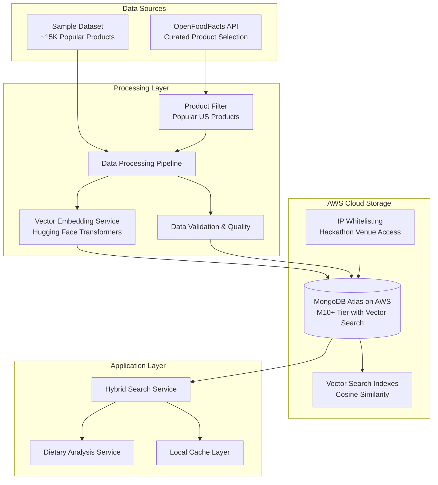

# Design Document

## Overview

This design document outlines the technical approach for implementing the data schema and ingestion phase of the SMARTIES project. The solution establishes a curated product data foundation using MongoDB Atlas deployed on AWS with Vector Search capabilities, enabling AI-powered semantic analysis of food products from the OpenFoodFacts database.

The design focuses on creating a performant system that supports both fast UPC barcode lookups (<100ms) and intelligent semantic search capabilities for dietary compliance analysis. The architecture leverages MongoDB Atlas Vector Search deployed on AWS with IP whitelisting for hackathon venue access, using Hugging Face Transformers for free, high-quality embeddings to enable advanced features like ingredient similarity detection, allergen risk analysis, and personalized product recommendations.

## Architecture

### High-Level Architecture



### Data Flow Architecture

1. **Ingestion Phase**: OpenFoodFacts API → Product Filtering → Processing Pipeline → Vector Generation → MongoDB Atlas on AWS (unified storage)
2. **Query Phase**: UPC/Semantic Query → MongoDB Atlas Vector Search → Hybrid Results → Dietary Analysis → Results  
3. **Update Phase**: Incremental API updates → Processing → MongoDB Atlas updates with IP whitelisting for hackathon venue access
4. **Network Security**: IP whitelisting configured for hackathon building access to MongoDB Atlas cluster on AWS

## Components and Interfaces

### 1. Data Processing Pipeline

**Purpose**: Transform OpenFoodFacts data into structured format with vector embeddings

**Key Components**:
- **DataExtractor**: Reads MongoDB dump and filters relevant products
- **DataCleaner**: Validates and normalizes product data
- **EmbeddingGenerator**: Creates vector embeddings for text fields
- **DataLoader**: Bulk inserts processed data into MongoDB Atlas

**Interface**:
```typescript
interface DataProcessingPipeline {
  extractProducts(source: DataSource): AsyncIterator<RawProduct>;
  cleanProduct(raw: RawProduct): CleanProduct | null;
  generateEmbeddings(product: CleanProduct): Promise<ProductWithEmbeddings>;
  loadProducts(products: ProductWithEmbeddings[]): Promise<LoadResult>;
}
```

### 2. Vector Embedding Service

**Purpose**: Generate high-quality embeddings for semantic search using free Hugging Face models

**Key Components**:
- **HuggingFaceEmbedder**: Local Sentence Transformers model (all-MiniLM-L6-v2)
- **BatchProcessor**: Efficient batch processing of embeddings
- **EmbeddingCache**: Cache frequently generated embeddings
- **ModelManager**: Handles model loading and memory management

**Model Specifications**:
- **Model**: `sentence-transformers/all-MiniLM-L6-v2`
- **Dimensions**: 384 (smaller than OpenAI but still effective)
- **Performance**: ~14K sentences/second on CPU
- **Size**: ~90MB download
- **Quality**: Excellent for semantic similarity tasks

**Interface**:
```typescript
interface VectorEmbeddingService {
  generateIngredientEmbedding(text: string): Promise<number[]>;
  generateProductNameEmbedding(text: string): Promise<number[]>;
  generateAllergenEmbedding(allergens: string[]): Promise<number[]>;
  batchGenerate(requests: EmbeddingRequest[]): Promise<EmbeddingResponse[]>;
  initializeModel(): Promise<void>;
}
```

**Implementation Example**:
```python
from sentence_transformers import SentenceTransformer
import numpy as np

class HuggingFaceEmbedder:
    def __init__(self):
        self.model = SentenceTransformer('all-MiniLM-L6-v2')
    
    def generate_embedding(self, text: str) -> np.ndarray:
        return self.model.encode(text, normalize_embeddings=True)
    
    def batch_generate(self, texts: list[str]) -> np.ndarray:
        return self.model.encode(texts, normalize_embeddings=True, batch_size=32)
```

### 3. Hybrid Search Service

**Purpose**: Combine exact UPC lookup with vector similarity search

**Key Components**:
- **ExactMatcher**: Fast UPC code lookups using indexes
- **VectorSearcher**: Semantic similarity search using embeddings
- **QueryOptimizer**: Determines optimal search strategy
- **ResultMerger**: Combines and ranks results from multiple sources

**Interface**:
```typescript
interface HybridSearchService {
  searchByUPC(code: string): Promise<Product | null>;
  searchBySimilarity(query: VectorQuery): Promise<SimilarityResult[]>;
  hybridSearch(request: SearchRequest): Promise<SearchResult>;
  findSimilarProducts(productId: string, limit: number): Promise<Product[]>;
}
```

### 4. Dietary Analysis Service

**Purpose**: Analyze products for dietary compliance and restrictions

**Key Components**:
- **AllergenDetector**: Identifies allergen risks using vector similarity
- **DietaryClassifier**: Determines dietary compliance (vegan, kosher, etc.)
- **RiskAssessment**: Calculates confidence scores for safety decisions
- **RecommendationEngine**: Suggests alternative products

**Interface**:
```typescript
interface DietaryAnalysisService {
  analyzeAllergens(product: Product, restrictions: AllergenRestriction[]): Promise<AllergenAnalysis>;
  checkDietaryCompliance(product: Product, preferences: DietaryPreference[]): Promise<ComplianceResult>;
  findAlternatives(product: Product, restrictions: Restriction[]): Promise<Product[]>;
  calculateRiskScore(product: Product, userProfile: UserProfile): Promise<RiskScore>;
}
```

## Data Models

### Core Product Schema

```typescript
interface Product {
  // Primary identifiers
  _id: ObjectId;
  code: string;                    // UPC/barcode (indexed)
  
  // Basic product information
  product_name: string;
  brands_tags: string[];
  categories_tags: string[];
  
  // Ingredient information
  ingredients_text: string;
  ingredients_tags: string[];
  ingredients_analysis_tags: string[];
  
  // Allergen information
  allergens_tags: string[];
  allergens_hierarchy: string[];
  traces_tags: string[];
  
  // Dietary labels and certifications
  labels_tags: string[];
  
  // Vector embeddings (384 dimensions each - Sentence Transformers)
  ingredients_embedding: number[];
  product_name_embedding: number[];
  allergens_embedding: number[];
  
  // Derived dietary compliance flags
  dietary_flags: {
    vegan: boolean;
    vegetarian: boolean;
    gluten_free: boolean;
    kosher: boolean;
    halal: boolean;
    organic: boolean;
  };
  
  // Data quality and metadata
  data_quality_score: number;      // 0.0 to 1.0
  last_updated: Date;
  source: 'openfoodfacts' | 'usda' | 'user_submission';
  
  // Search optimization
  popularity_score: number;        // For ranking results
  completeness_score: number;      // Data completeness metric
}
```

### Vector Search Query Models

```typescript
interface VectorQuery {
  embedding: number[];
  similarity_threshold: number;    // Minimum cosine similarity (0.0-1.0)
  limit: number;
  filters?: {
    dietary_flags?: Partial<DietaryFlags>;
    allergen_exclusions?: string[];
    categories?: string[];
  };
}

interface SimilarityResult {
  product: Product;
  similarity_score: number;        // Cosine similarity (0.0-1.0)
  match_type: 'ingredient' | 'product_name' | 'allergen';
}
```

### Dietary Analysis Models

```typescript
interface AllergenAnalysis {
  detected_allergens: DetectedAllergen[];
  risk_level: 'low' | 'medium' | 'high' | 'severe';
  confidence_score: number;        // 0.0-1.0
  similar_products_with_allergens: Product[];
}

interface DetectedAllergen {
  allergen: string;
  source: 'direct' | 'trace' | 'similarity';
  confidence: number;
  evidence: string[];              // Ingredient names or similar products
}

interface ComplianceResult {
  compliant: boolean;
  violations: DietaryViolation[];
  alternatives: Product[];
  confidence_score: number;
}
```

## Error Handling

### Data Processing Errors

**Strategy**: Graceful degradation with comprehensive logging

**Error Categories**:
1. **Data Quality Issues**: Invalid UPC codes, missing ingredients, malformed data
2. **Embedding Generation Failures**: API rate limits, network timeouts, invalid text
3. **Database Errors**: Connection failures, index corruption, storage limits
4. **Vector Search Errors**: Index unavailable, query malformation, timeout

**Error Handling Patterns**:
```typescript
class DataProcessingError extends Error {
  constructor(
    message: string,
    public readonly errorType: 'validation' | 'embedding' | 'storage',
    public readonly productCode?: string,
    public readonly retryable: boolean = false
  ) {
    super(message);
  }
}

// Retry logic for transient failures
async function processWithRetry<T>(
  operation: () => Promise<T>,
  maxRetries: number = 3,
  backoffMs: number = 1000
): Promise<T> {
  for (let attempt = 1; attempt <= maxRetries; attempt++) {
    try {
      return await operation();
    } catch (error) {
      if (attempt === maxRetries || !isRetryableError(error)) {
        throw error;
      }
      await delay(backoffMs * Math.pow(2, attempt - 1));
    }
  }
  throw new Error('Max retries exceeded');
}
```

### Search and Analysis Errors

**Fallback Strategies**:
1. **Vector Search Failure**: Fall back to exact text matching
2. **Embedding Service Unavailable**: Use cached embeddings or simplified analysis
3. **Dietary Analysis Failure**: Return conservative "unknown" results with warnings

## Testing Strategy

### Unit Testing

**Focus Areas**:
- Data validation and cleaning logic
- Vector embedding generation and caching
- Dietary compliance rule evaluation
- Search result ranking and filtering

**Test Categories**:
```typescript
describe('DataProcessingPipeline', () => {
  describe('Product Validation', () => {
    it('should reject products without valid UPC codes');
    it('should normalize ingredient text formatting');
    it('should extract allergen information correctly');
  });
  
  describe('Embedding Generation', () => {
    it('should generate consistent embeddings for identical text');
    it('should handle empty or null ingredient text gracefully');
    it('should batch process embeddings efficiently');
  });
});

describe('HybridSearchService', () => {
  describe('UPC Lookup', () => {
    it('should return exact matches in under 100ms');
    it('should handle invalid UPC formats gracefully');
  });
  
  describe('Vector Search', () => {
    it('should find similar products with high accuracy');
    it('should respect similarity thresholds');
    it('should apply dietary filters correctly');
  });
});
```

### Integration Testing

**Test Scenarios**:
1. **End-to-End Data Pipeline**: Raw OpenFoodFacts data → Processed products in MongoDB
2. **Vector Search Performance**: Large-scale similarity queries with timing validation
3. **Dietary Analysis Accuracy**: Known products with verified dietary compliance results
4. **Hybrid Search Functionality**: Combined UPC + similarity search workflows

### Performance Testing

**Benchmarks**:
- UPC lookup: <100ms (99th percentile)
- Vector similarity search: <500ms (95th percentile)
- Batch embedding generation: >1000 products/minute
- Data ingestion throughput: >10,000 products/minute

**Load Testing**:
```typescript
describe('Performance Tests', () => {
  it('should handle 1000 concurrent UPC lookups', async () => {
    const promises = Array(1000).fill(0).map(() => 
      searchService.searchByUPC(generateRandomUPC())
    );
    const start = Date.now();
    await Promise.all(promises);
    const duration = Date.now() - start;
    expect(duration).toBeLessThan(5000); // 5 seconds for 1000 requests
  });
});
```

## MongoDB Atlas Vector Search Configuration

### Index Configuration

```javascript
// Vector Search Index for ingredients
{
  "fields": [
    {
      "type": "vector",
      "path": "ingredients_embedding",
      "numDimensions": 384,
      "similarity": "cosine"
    },
    {
      "type": "filter",
      "path": "dietary_flags"
    },
    {
      "type": "filter", 
      "path": "allergens_tags"
    }
  ]
}

// Compound index for hybrid search
{
  "code": 1,                    // Exact UPC lookup
  "popularity_score": -1,       // Ranking factor
  "data_quality_score": -1      // Quality ranking
}

// Text search index for fallback
{
  "product_name": "text",
  "ingredients_text": "text",
  "brands_tags": "text"
}
```

### Query Optimization Strategies

**UPC Lookup Optimization**:
```javascript
// Optimized exact match with projection
db.products.findOne(
  { code: "1234567890123" },
  { 
    code: 1, 
    product_name: 1, 
    ingredients_text: 1, 
    allergens_tags: 1,
    dietary_flags: 1 
  }
);
```

**Vector Similarity Search**:
```javascript
// MongoDB Atlas Vector Search aggregation
db.products.aggregate([
  {
    $vectorSearch: {
      index: "ingredients_vector_index",
      path: "ingredients_embedding",
      queryVector: [0.1, 0.2, ...], // 384-dimensional vector
      numCandidates: 1000,
      limit: 50,
      filter: {
        "dietary_flags.vegan": true,
        "allergens_tags": { $nin: ["en:milk", "en:eggs"] }
      }
    }
  },
  {
    $addFields: {
      similarity_score: { $meta: "vectorSearchScore" }
    }
  },
  {
    $match: {
      similarity_score: { $gte: 0.7 }
    }
  }
]);
```

## Deployment and Scaling Considerations

### MongoDB Atlas on AWS Configuration

**Cluster Specifications**:
- **Tier**: M10 minimum (for Vector Search support) - $0.08/hour = ~$58/month
- **Cloud Provider**: AWS (us-east-1 or preferred region)
- **Storage**: 10GB initial (sufficient for curated dataset)
- **Network Security**: IP whitelisting for hackathon venue
- **Backup**: Standard backup with point-in-time recovery

**Vector Search Configuration**:
- Maximum 10 vector indexes per collection
- Maximum 2048 dimensions per vector field (using 384 for Sentence Transformers)
- Query timeout: 60 seconds maximum
- **IP Whitelisting**: Configure hackathon venue IP address for database access
- **AWS Region**: Deploy in same region as application for low latency

### Performance Monitoring

**Key Metrics**:
- Vector search query latency (target: <500ms p95)
- UPC lookup latency (target: <100ms p99)
- Embedding generation rate (target: >1000/minute)
- Index build time for new data
- Storage growth rate and optimization

**Alerting Thresholds**:
- Query latency >1 second (warning)
- Error rate >1% (critical)
- Storage utilization >80% (warning)
- Embedding API failures >5% (critical)

This design provides a comprehensive foundation for the data schema and ingestion phase, enabling both high-performance exact lookups and sophisticated AI-powered semantic analysis for the SMARTIES application.