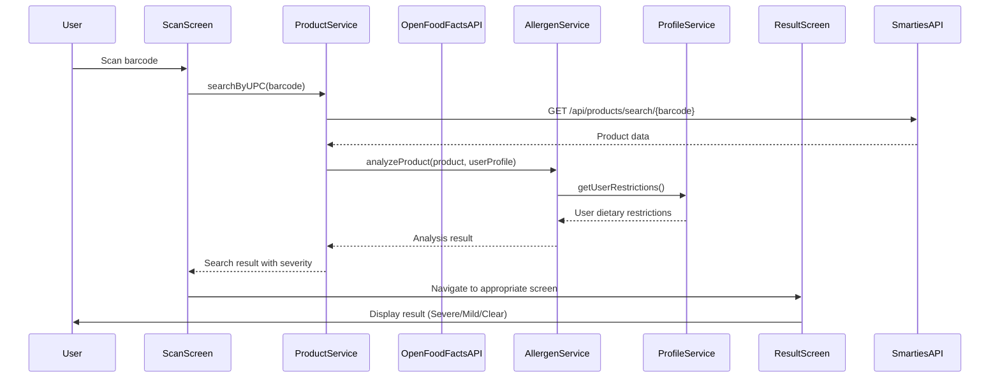
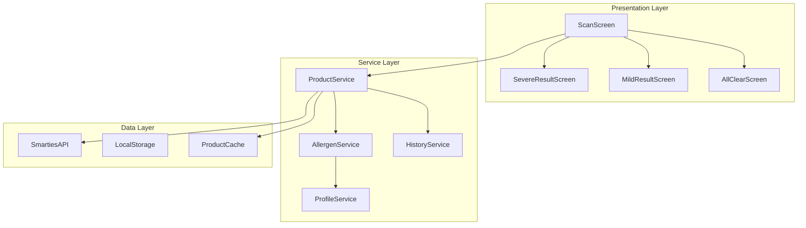

# Design Document

## Overview

This design document outlines the UPC Product Search and Allergen Detection feature for the SMARTIES mobile application. The system uses the existing SMARTIES API and MongoDB database to retrieve product information in real-time when users scan barcodes, performs allergen analysis against their dietary profile, and displays appropriate result screens based on violation severity.

## Architecture

### High-Level Flow



### Component Architecture



## Components and Interfaces

### ProductService

**Purpose**: Handles product lookup, caching, and orchestrates the search workflow.

```typescript
interface ProductService {
  searchByUPC(barcode: string): Promise<ProductSearchResult>;
  cacheProduct(product: Product): Promise<void>;
  getCachedProduct(barcode: string): Promise<Product | null>;
}

interface ProductSearchResult {
  success: boolean;
  product?: Product;
  analysisResult?: AllergenAnalysisResult;
  error?: string;
}

interface Product {
  upc: string;
  name: string;
  brand?: string;
  ingredients: string[];
  allergenInfo: {
    contains: string[];
    mayContain: string[];
  };
  nutritionalInfo?: NutritionalInfo;
  imageUrl?: string;
}
```

### AllergenService

**Purpose**: Analyzes products against user dietary restrictions and determines violation severity.

```typescript
interface AllergenService {
  analyzeProduct(product: Product, userProfile: UserProfile): AllergenAnalysisResult;
  detectAllergens(ingredients: string[]): string[];
  determineSeverity(violations: DietaryViolation[], userProfile: UserProfile): ViolationSeverity;
}

interface AllergenAnalysisResult {
  violations: DietaryViolation[];
  severity: ViolationSeverity;
  riskLevel?: string;
  safeForConsumption: boolean;
}

interface DietaryViolation {
  allergen: string;
  source: 'ingredient' | 'contains' | 'mayContain';
  restrictionType: RestrictionType;
  severity: RestrictionSeverity;
}

enum ViolationSeverity {
  NONE = 'none',
  MILD = 'mild',
  SEVERE = 'severe'
}
```

### Result Screen Components

**Purpose**: Display appropriate result screens based on analysis severity.

```typescript
interface ResultScreenProps {
  product: Product;
  analysisResult: AllergenAnalysisResult;
  onSaveToHistory: () => void;
  onReportIssue: () => void;
  onDone?: () => void;
}

// Severe Allergy Result Screen
interface SevereResultScreenProps extends ResultScreenProps {
  riskLevel: string; // e.g., "Anaphylactic"
  primaryViolation: DietaryViolation;
}

// Mild Warning Result Screen
interface MildResultScreenProps extends ResultScreenProps {
  violations: DietaryViolation[];
}

// All Clear Result Screen
interface AllClearScreenProps extends ResultScreenProps {
  // No additional props needed
}
```

### SMARTIES API Integration

**Purpose**: Interface with existing SMARTIES API for product data retrieval from MongoDB database.

```typescript
interface SmartiesAPIClient {
  searchProductByUPC(barcode: string): Promise<APIProductResponse>;
  getProductDetails(productId: string): Promise<Product>;
}

interface APIProductResponse {
  success: boolean;
  data?: {
    _id: string;
    upc: string;
    name: string;
    brand?: string;
    ingredients: string[];
    allergens: {
      contains: string[];
      mayContain: string[];
    };
    nutritionalInfo?: NutritionalInfo;
    imageUrl?: string;
    lastUpdated: Date;
  };
  error?: string;
}
```

## Data Models

### Product Data Structure

```typescript
interface Product {
  upc: string;
  name: string;
  brand?: string;
  ingredients: string[];
  allergenInfo: {
    contains: string[];      // Definitive allergen presence
    mayContain: string[];    // Cross-contamination warnings
  };
  nutritionalInfo?: {
    calories?: number;
    sodium?: number;
    sugar?: number;
    // Additional nutritional data
  };
  imageUrl?: string;
  lastUpdated: Date;
  source: 'database' | 'manual' | 'cached';
}
```

### Analysis Result Structure

```typescript
interface AllergenAnalysisResult {
  violations: DietaryViolation[];
  severity: ViolationSeverity;
  riskLevel?: string;
  safeForConsumption: boolean;
  analysisTimestamp: Date;
  confidence: number; // 0-1 scale
}

interface DietaryViolation {
  allergen: string;
  source: 'ingredient' | 'contains' | 'mayContain';
  restrictionType: RestrictionType;
  severity: RestrictionSeverity;
  matchedText: string; // The specific text that triggered the violation
}
```

## Error Handling

### Error Types and Responses

```typescript
enum ProductSearchError {
  PRODUCT_NOT_FOUND = 'PRODUCT_NOT_FOUND',
  API_ERROR = 'API_ERROR',
  NETWORK_ERROR = 'NETWORK_ERROR',
  INVALID_BARCODE = 'INVALID_BARCODE',
  ANALYSIS_ERROR = 'ANALYSIS_ERROR'
}

interface ErrorHandlingStrategy {
  [ProductSearchError.PRODUCT_NOT_FOUND]: () => void; // Show manual entry option
  [ProductSearchError.API_ERROR]: () => void;         // Show retry option
  [ProductSearchError.NETWORK_ERROR]: () => void;     // Check cache, show offline message
  [ProductSearchError.INVALID_BARCODE]: () => void;   // Return to scanning
  [ProductSearchError.ANALYSIS_ERROR]: () => void;    // Show generic warning, allow manual review
}
```

### Fallback Strategies

1. **Offline Mode**: Use cached product data when network is unavailable
2. **Partial Data**: Proceed with analysis even if some product data is missing
3. **Analysis Failure**: Default to showing a generic warning screen with manual review option
4. **API Rate Limiting**: Implement exponential backoff and queue requests

## Testing Strategy

### Unit Testing Focus Areas

1. **ProductService**: UPC validation, API integration, caching logic
2. **AllergenService**: Ingredient parsing, allergen detection, severity determination
3. **Result Screen Components**: Proper rendering based on analysis results
4. **Error Handling**: All error scenarios and fallback behaviors

### Integration Testing Scenarios

1. **End-to-End Flow**: Scan → Search → Analysis → Result Display
2. **API Integration**: Real Open Food Facts API calls with various product types
3. **Profile Integration**: Analysis with different user restriction profiles
4. **Offline Scenarios**: Cached data usage when network is unavailable

### Test Data Requirements

```typescript
interface TestScenarios {
  severeAllergenProducts: Product[];    // Products with life-threatening allergens
  mildViolationProducts: Product[];     // Products with lifestyle violations
  safeProducts: Product[];              // Products with no violations
  unknownProducts: string[];            // UPCs not in Open Food Facts
  malformedData: any[];                 // Invalid API responses
}
```

## Performance Considerations

### Response Time Targets

- **Product Lookup**: < 2 seconds for API calls
- **Allergen Analysis**: < 500ms for local processing
- **Screen Navigation**: < 200ms transition time
- **Cache Retrieval**: < 100ms for local data

### Optimization Strategies

1. **Caching**: Store frequently accessed products locally
2. **Prefetching**: Cache popular products during app idle time
3. **Compression**: Minimize API response payload size
4. **Debouncing**: Prevent duplicate API calls for same UPC
5. **Background Processing**: Perform analysis while displaying loading state

### Memory Management

```typescript
interface CacheConfiguration {
  maxProducts: 1000;           // Maximum cached products
  maxAge: 7 * 24 * 60 * 60;   // 7 days in seconds
  cleanupInterval: 60 * 60;    // Cleanup every hour
  priorityProducts: string[];  // UPCs to never evict
}
```

## Security and Privacy

### Data Protection

1. **API Keys**: Store Open Food Facts API credentials securely
2. **User Data**: Encrypt cached dietary profiles
3. **Network Security**: Use HTTPS for all API communications
4. **Data Minimization**: Only cache essential product information

### Privacy Considerations

1. **Anonymous Usage**: Don't send user dietary restrictions to Open Food Facts
2. **Local Analysis**: Perform allergen analysis on device
3. **Opt-in Reporting**: User consent required for issue reporting
4. **Data Retention**: Clear old scan history based on user preferences

## Implementation Notes

### SMARTIES API Integration

```typescript
// Example API endpoint usage
const API_BASE = process.env.SMARTIES_API_BASE || 'http://localhost:3000';
const PRODUCT_SEARCH_ENDPOINT = `${API_BASE}/api/products/search/{barcode}`;

// Required headers
const headers = {
  'Content-Type': 'application/json',
  'Accept': 'application/json',
  'Authorization': `Bearer ${userToken}` // If authentication required
};
```

### Allergen Detection Logic

```typescript
// Allergen mapping patterns
const ALLERGEN_PATTERNS = {
  milk: ['milk', 'dairy', 'whey', 'casein', 'lactose', 'butter'],
  eggs: ['egg', 'albumin', 'lecithin', 'mayonnaise'],
  peanuts: ['peanut', 'groundnut', 'arachis'],
  // ... additional patterns
};

// Severity determination logic
function determineSeverity(violations: DietaryViolation[], profile: UserProfile): ViolationSeverity {
  const severeViolations = violations.filter(v => 
    profile.restrictions.find(r => 
      r.allergen === v.allergen && r.severity === RestrictionSeverity.SEVERE
    )
  );
  
  if (severeViolations.length > 0) return ViolationSeverity.SEVERE;
  if (violations.length > 0) return ViolationSeverity.MILD;
  return ViolationSeverity.NONE;
}
```

This design provides a comprehensive foundation for implementing the UPC product search and allergen detection feature, ensuring safety-first operation while maintaining good user experience and performance.