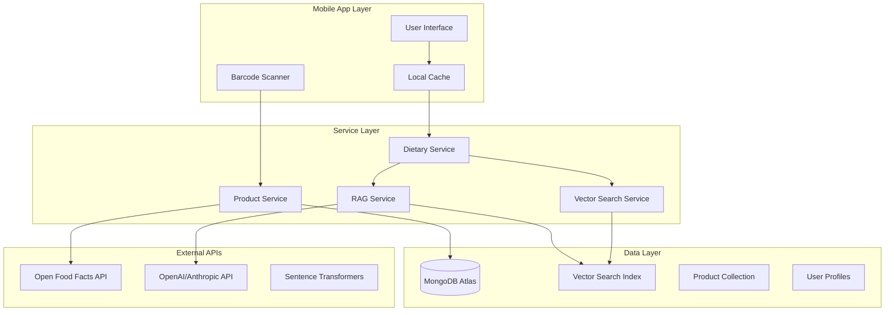
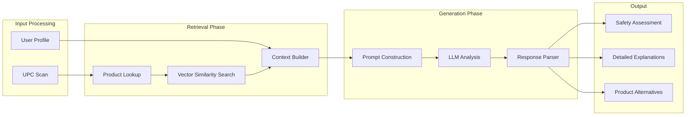

# Design Document

## Overview

This design document outlines the implementation of a comprehensive vector search and RAG (Retrieval-Augmented Generation) system for SMARTIES dietary compliance analysis. The system combines MongoDB Atlas Vector Search with AI-powered reasoning to provide instant, accurate dietary restriction checking through UPC barcode scanning. The architecture prioritizes safety, performance, and offline capability while delivering personalized recommendations for users with complex dietary needs.

## Architecture

### High-Level System Architecture



### RAG Pipeline Architecture



## Components and Interfaces

### Core Services

#### ProductService
**Responsibility:** UPC-based product lookup and data management
```typescript
interface ProductService {
  lookupByUPC(upc: string): Promise<Product | null>;
  searchSimilarProducts(productId: string, limit: number): Promise<Product[]>;
  cacheProduct(product: Product): Promise<void>;
  syncWithOpenFoodFacts(upc: string): Promise<Product>;
}
```

#### VectorSearchService
**Responsibility:** Semantic similarity search using MongoDB Atlas Vector Search
```typescript
interface VectorSearchService {
  generateEmbedding(text: string): Promise<number[]>;
  findSimilarIngredients(ingredients: string[], limit: number): Promise<SimilarIngredient[]>;
  findSimilarProducts(embedding: number[], filters: SearchFilters): Promise<Product[]>;
  buildVectorIndex(): Promise<void>;
}
```

#### RAGService
**Responsibility:** Retrieval-Augmented Generation for dietary compliance analysis
```typescript
interface RAGService {
  analyzeDietaryCompliance(product: Product, userProfile: UserProfile): Promise<ComplianceAnalysis>;
  buildRAGContext(product: Product, userProfile: UserProfile): Promise<RAGContext>;
  generatePrompt(context: RAGContext): string;
  parseAIResponse(response: string): ComplianceAnalysis;
}
```

#### DietaryService
**Responsibility:** Orchestrates the complete dietary analysis workflow
```typescript
interface DietaryService {
  scanAndAnalyze(upc: string, userProfile: UserProfile): Promise<DietaryAnalysisResult>;
  getAlternativeProducts(product: Product, userProfile: UserProfile): Promise<Product[]>;
  updateAnalysisCache(upc: string, analysis: DietaryAnalysisResult): Promise<void>;
  validateSafety(analysis: DietaryAnalysisResult): SafetyValidation;
}
```

### Data Models

#### Product Model
```typescript
interface Product {
  id: string;
  upc: string;
  name: string;
  brand: string;
  ingredients: string[];
  nutritionalInfo: NutritionalInfo;
  certifications: Certification[];
  allergenWarnings: string[];
  embedding?: number[];
  confidence: number;
  lastUpdated: Date;
}
```

#### UserProfile Model
```typescript
interface UserProfile {
  id: string;
  allergies: AllergyRestriction[];
  religiousRestrictions: ReligiousRestriction[];
  medicalConditions: MedicalRestriction[];
  lifestylePreferences: LifestyleRestriction[];
  severitySettings: SeveritySettings;
  familyProfiles?: UserProfile[];
}
```

#### ComplianceAnalysis Model
```typescript
interface ComplianceAnalysis {
  safetyLevel: 'safe' | 'caution' | 'danger';
  overallScore: number;
  violations: Violation[];
  warnings: Warning[];
  explanations: string[];
  confidence: number;
  alternatives: ProductRecommendation[];
  familyAnalysis?: FamilyComplianceAnalysis;
}
```

#### RAGContext Model
```typescript
interface RAGContext {
  product: Product;
  userProfile: UserProfile;
  similarProducts: Product[];
  similarIngredients: SimilarIngredient[];
  dietaryGuidelines: DietaryGuideline[];
  certificationRules: CertificationRule[];
}
```

## Data Models

### MongoDB Collections

#### Products Collection
```javascript
{
  _id: ObjectId,
  upc: "string", // Indexed
  name: "string",
  brand: "string",
  ingredients: ["string"],
  nutritionalInfo: {
    calories: Number,
    protein: Number,
    carbohydrates: Number,
    fat: Number,
    sodium: Number,
    sugar: Number
  },
  certifications: [{
    type: "halal" | "kosher" | "organic" | "vegan",
    certifier: "string",
    verified: Boolean
  }],
  allergenWarnings: ["string"],
  embedding: [Number], // Vector for similarity search
  confidence: Number,
  source: "openfoodfacts" | "manual" | "api",
  lastUpdated: Date,
  // Vector Search Index on 'embedding' field
}
```

#### UserProfiles Collection
```javascript
{
  _id: ObjectId,
  userId: "string",
  allergies: [{
    allergen: "string",
    severity: "mild" | "moderate" | "severe",
    crossContamination: Boolean
  }],
  religiousRestrictions: [{
    type: "halal" | "kosher" | "hindu_vegetarian" | "jain",
    strictness: "strict" | "moderate" | "flexible"
  }],
  medicalConditions: [{
    condition: "diabetes" | "hypertension" | "kidney_disease",
    restrictions: {
      maxSodium?: Number,
      maxSugar?: Number,
      maxCarbs?: Number
    }
  }],
  lifestylePreferences: [{
    type: "vegan" | "vegetarian" | "keto" | "paleo",
    strictness: "strict" | "flexible"
  }],
  familyProfiles: [ObjectId], // References to other profiles
  createdAt: Date,
  updatedAt: Date
}
```

#### AnalysisCache Collection
```javascript
{
  _id: ObjectId,
  upc: "string",
  userProfileHash: "string", // Hash of user restrictions
  analysis: {
    safetyLevel: "string",
    violations: [Object],
    explanations: ["string"],
    confidence: Number,
    alternatives: [Object]
  },
  expiresAt: Date, // TTL index for automatic cleanup
  createdAt: Date
}
```

### Vector Search Index Configuration
```javascript
{
  "fields": [
    {
      "type": "vector",
      "path": "embedding",
      "numDimensions": 384, // Sentence transformer dimension
      "similarity": "cosine"
    },
    {
      "type": "filter",
      "path": "certifications.type"
    },
    {
      "type": "filter", 
      "path": "allergenWarnings"
    }
  ]
}
```

## Error Handling

### Error Classification and Response Strategy

#### Critical Errors (Safety Impact)
- **Product Not Found**: Return "unknown product" warning, suggest manual entry
- **AI Service Unavailable**: Use cached analysis or basic rule-based checking
- **Embedding Generation Failed**: Fall back to text-based ingredient matching
- **Vector Search Failed**: Use traditional database queries with keyword matching

#### Non-Critical Errors (Performance Impact)
- **Cache Miss**: Proceed with fresh analysis, log for optimization
- **Slow API Response**: Show loading indicator, implement timeout with fallback
- **Partial Data**: Analyze available data, flag uncertainty in results

### Error Handling Implementation
```typescript
class DietaryAnalysisError extends Error {
  constructor(
    message: string,
    public severity: 'critical' | 'warning' | 'info',
    public fallbackStrategy: string,
    public userMessage: string
  ) {
    super(message);
  }
}

// Error handling in RAG service
async analyzeDietaryCompliance(product: Product, userProfile: UserProfile): Promise<ComplianceAnalysis> {
  try {
    const context = await this.buildRAGContext(product, userProfile);
    const aiResponse = await this.callLLM(context);
    return this.parseResponse(aiResponse);
  } catch (error) {
    if (error instanceof AIServiceError) {
      // Fall back to rule-based analysis
      return this.fallbackAnalysis(product, userProfile);
    }
    throw new DietaryAnalysisError(
      'Analysis failed',
      'critical',
      'manual review recommended',
      'Unable to analyze this product. Please review ingredients manually.'
    );
  }
}
```

## Testing Strategy

### Unit Testing Focus Areas

#### Vector Search Service Tests
```typescript
describe('VectorSearchService', () => {
  test('should generate consistent embeddings for same text', async () => {
    const text = 'wheat flour, sugar, eggs';
    const embedding1 = await vectorService.generateEmbedding(text);
    const embedding2 = await vectorService.generateEmbedding(text);
    expect(embedding1).toEqual(embedding2);
  });

  test('should find similar ingredients with high confidence', async () => {
    const ingredients = ['milk powder', 'lactose'];
    const similar = await vectorService.findSimilarIngredients(ingredients, 5);
    expect(similar.some(s => s.ingredient.includes('dairy'))).toBe(true);
  });
});
```

#### RAG Service Tests
```typescript
describe('RAGService', () => {
  test('should build comprehensive context for analysis', async () => {
    const product = mockProductWithAllergens(['milk', 'eggs']);
    const userProfile = mockUserWithAllergies(['dairy']);
    
    const context = await ragService.buildRAGContext(product, userProfile);
    
    expect(context.similarProducts).toHaveLength(5);
    expect(context.dietaryGuidelines).toContain('dairy allergy guidelines');
  });

  test('should prioritize safety in uncertain scenarios', async () => {
    const uncertainProduct = mockProductWithIncompleteData();
    const severeAllergyProfile = mockUserWithSevereAllergies();
    
    const analysis = await ragService.analyzeDietaryCompliance(uncertainProduct, severeAllergyProfile);
    
    expect(analysis.safetyLevel).toBe('danger');
    expect(analysis.explanations).toContain('insufficient data');
  });
});
```

### Integration Testing Scenarios

#### End-to-End UPC Scanning Flow
```typescript
describe('UPC Scanning Integration', () => {
  test('should complete full analysis within 3 seconds', async () => {
    const startTime = Date.now();
    const upc = '123456789012';
    const userProfile = mockComplexUserProfile();
    
    const result = await dietaryService.scanAndAnalyze(upc, userProfile);
    const duration = Date.now() - startTime;
    
    expect(duration).toBeLessThan(3000);
    expect(result.analysis.safetyLevel).toBeDefined();
  });

  test('should handle offline scenario gracefully', async () => {
    // Simulate offline condition
    mockNetworkOffline();
    
    const result = await dietaryService.scanAndAnalyze('123456789012', mockUserProfile());
    
    expect(result.source).toBe('cache');
    expect(result.analysis).toBeDefined();
  });
});
```

### Performance Testing Requirements

#### Load Testing Targets
- **Concurrent Users**: 100 simultaneous scans
- **Response Time**: 95th percentile < 3 seconds
- **Throughput**: 50 scans per second sustained
- **Memory Usage**: < 100MB per active session

#### Vector Search Performance
- **Index Build Time**: < 5 minutes for 100K products
- **Query Response**: < 500ms for similarity search
- **Embedding Generation**: < 100ms per product

## Performance Optimization

### Caching Strategy

#### Multi-Level Caching Architecture
```typescript
interface CacheStrategy {
  // Level 1: In-memory cache for current session
  sessionCache: Map<string, ComplianceAnalysis>;
  
  // Level 2: Local device storage for offline capability
  localCache: AsyncStorage;
  
  // Level 3: MongoDB cache collection for cross-device sync
  databaseCache: Collection<AnalysisCache>;
}
```

#### Cache Implementation
```typescript
class AnalysisCacheService {
  async getCachedAnalysis(upc: string, userProfileHash: string): Promise<ComplianceAnalysis | null> {
    // Check session cache first
    const sessionKey = `${upc}-${userProfileHash}`;
    if (this.sessionCache.has(sessionKey)) {
      return this.sessionCache.get(sessionKey);
    }
    
    // Check local storage
    const localResult = await AsyncStorage.getItem(sessionKey);
    if (localResult && !this.isExpired(localResult)) {
      return JSON.parse(localResult);
    }
    
    // Check database cache
    const dbResult = await this.databaseCache.findOne({
      upc,
      userProfileHash,
      expiresAt: { $gt: new Date() }
    });
    
    return dbResult?.analysis || null;
  }
}
```

### Vector Search Optimization

#### Embedding Optimization
```typescript
class OptimizedEmbeddingService {
  private embeddingCache = new Map<string, number[]>();
  
  async generateEmbedding(text: string): Promise<number[]> {
    // Normalize and cache embeddings
    const normalizedText = this.normalizeIngredientText(text);
    
    if (this.embeddingCache.has(normalizedText)) {
      return this.embeddingCache.get(normalizedText)!;
    }
    
    const embedding = await this.sentenceTransformer.encode(normalizedText);
    this.embeddingCache.set(normalizedText, embedding);
    
    return embedding;
  }
  
  private normalizeIngredientText(text: string): string {
    return text
      .toLowerCase()
      .replace(/[^\w\s,]/g, '') // Remove special characters
      .split(',')
      .map(ingredient => ingredient.trim())
      .sort() // Consistent ordering
      .join(', ');
  }
}
```

### LLM Cost Optimization

#### Prompt Engineering for Efficiency
```typescript
class OptimizedPromptBuilder {
  buildPrompt(context: RAGContext): string {
    // Use structured, concise prompts to minimize token usage
    return `
DIETARY ANALYSIS REQUEST
Product: ${context.product.name}
Ingredients: ${context.product.ingredients.slice(0, 10).join(', ')}
User Restrictions: ${this.summarizeRestrictions(context.userProfile)}
Similar Products: ${context.similarProducts.slice(0, 3).map(p => p.name).join(', ')}

ANALYSIS REQUIRED:
1. Safety Level: safe/caution/danger
2. Violations: List specific violations
3. Confidence: 0-100
4. Alternatives: Max 2 suggestions

RESPONSE FORMAT: JSON only, no explanation text
`;
  }
}
```

#### Response Caching Strategy
```typescript
class LLMResponseCache {
  private responseCache = new Map<string, CachedResponse>();
  
  async getCachedResponse(promptHash: string): Promise<string | null> {
    const cached = this.responseCache.get(promptHash);
    if (cached && !this.isExpired(cached)) {
      return cached.response;
    }
    return null;
  }
  
  async cacheResponse(promptHash: string, response: string): Promise<void> {
    this.responseCache.set(promptHash, {
      response,
      timestamp: Date.now(),
      expiresAt: Date.now() + (24 * 60 * 60 * 1000) // 24 hours
    });
  }
}
```

This comprehensive design provides a robust foundation for implementing the vector search and RAG system while prioritizing safety, performance, and user experience. The architecture supports offline capability, efficient caching, and scalable AI integration while maintaining the safety-first approach required for dietary compliance applications.