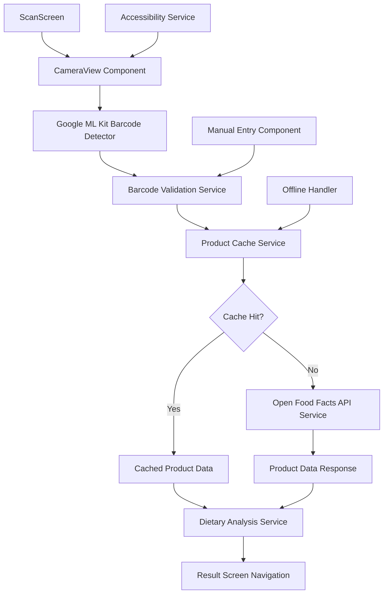
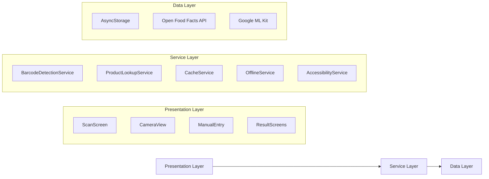

# Design Document

## Overview

This design document outlines the implementation of Google ML Kit barcode scanning functionality for the SMARTIES React Native application. The solution replaces the current backend-dependent barcode scanning with a direct client-side implementation that uses Google ML Kit for barcode detection and the Open Food Facts API for product data retrieval. This approach eliminates the need for a custom backend while providing a world-class scanning experience with sub-3-second response times and comprehensive offline capabilities.

The design follows the established SMARTIES architecture patterns while integrating modern barcode scanning best practices from the Open Food Facts ecosystem and Google ML Kit capabilities.

## Architecture

### High-Level Component Flow



### Service Layer Architecture



## Components and Interfaces

### Core Components

#### 1. Enhanced ScanScreen Component
**Location:** `src/screens/ScanScreen.tsx`
**Purpose:** Main scanning interface with camera integration and user guidance

```typescript
interface ScanScreenProps {
  navigation: NavigationProp<any>;
}

interface ScanScreenState {
  isScanning: boolean;
  torchEnabled: boolean;
  showManualEntry: boolean;
  isProcessing: boolean;
  lastScannedCode?: string;
  connectivityStatus: 'online' | 'offline';
}
```

#### 2. CameraView Component
**Location:** `src/components/scanner/CameraView.tsx`
**Purpose:** Camera interface with ML Kit integration and viewfinder overlay

```typescript
interface CameraViewProps {
  onBarcodeDetected: (barcode: string) => void;
  onError: (error: Error) => void;
  isProcessing: boolean;
  torchEnabled: boolean;
}

interface ViewfinderOverlayProps {
  isScanning: boolean;
  showGuidance: boolean;
}
```

#### 3. ManualEntryModal Component
**Location:** `src/components/scanner/ManualEntryModal.tsx`
**Purpose:** Fallback barcode input for damaged or unreadable codes

```typescript
interface ManualEntryModalProps {
  visible: boolean;
  onSubmit: (barcode: string) => void;
  onCancel: () => void;
}
```

### Service Interfaces

#### 1. BarcodeDetectionService
**Location:** `src/services/barcode/BarcodeDetectionService.ts`
**Purpose:** Google ML Kit integration and barcode validation

```typescript
interface IBarcodeDetectionService {
  initializeDetector(): Promise<void>;
  validateBarcode(rawCode: string): BarcodeValidationResult;
  normalizeBarcode(rawCode: string): string;
  calculateCheckDigit(code: string): boolean;
}

interface BarcodeValidationResult {
  isValid: boolean;
  normalizedCode: string;
  format: BarcodeFormat;
  error?: string;
}

enum BarcodeFormat {
  EAN8 = 'EAN-8',
  EAN13 = 'EAN-13',
  UPCA = 'UPC-A',
  UPCE = 'UPC-E',
  UNKNOWN = 'UNKNOWN'
}
```

#### 2. ProductLookupService
**Location:** `src/services/api/ProductLookupService.ts`
**Purpose:** Open Food Facts API integration with proper error handling

```typescript
interface IProductLookupService {
  lookupProduct(barcode: string): Promise<ProductLookupResult>;
  buildApiUrl(barcode: string): string;
  buildUserAgent(): string;
}

interface ProductLookupResult {
  success: boolean;
  product?: OpenFoodFactsProduct;
  status: 'found' | 'not_found' | 'network_error' | 'server_error';
  error?: string;
}

interface OpenFoodFactsProduct {
  code: string;
  product_name: string;
  ingredients_text: string;
  allergens: string;
  image_front_url?: string;
  nutriments?: Record<string, any>;
  nutriscore_grade?: string;
}
```

#### 3. ProductCacheService
**Location:** `src/services/cache/ProductCacheService.ts`
**Purpose:** Local product data caching with TTL and size management

```typescript
interface IProductCacheService {
  getCachedProduct(barcode: string): Promise<CachedProduct | null>;
  cacheProduct(barcode: string, product: OpenFoodFactsProduct): Promise<void>;
  clearExpiredCache(): Promise<void>;
  getCacheStats(): Promise<CacheStats>;
}

interface CachedProduct {
  product: OpenFoodFactsProduct;
  cachedAt: Date;
  expiresAt: Date;
}

interface CacheStats {
  totalProducts: number;
  cacheSize: number;
  oldestEntry: Date;
  newestEntry: Date;
}
```

## Data Models

### Barcode Processing Models

```typescript
interface ScannedBarcode {
  rawValue: string;
  normalizedValue: string;
  format: BarcodeFormat;
  boundingBox: BoundingBox;
  cornerPoints: Point[];
  scannedAt: Date;
}

interface BoundingBox {
  left: number;
  top: number;
  width: number;
  height: number;
}

interface Point {
  x: number;
  y: number;
}
```

### API Response Models

```typescript
interface OpenFoodFactsResponse {
  code: string;
  product?: OpenFoodFactsProduct;
  status: number; // 1 = found, 0 = not found
  status_verbose: string;
}

interface ProductNotFoundResponse {
  code: string;
  status: 0;
  status_verbose: "product not found";
}
```

### Cache Storage Models

```typescript
interface CacheEntry {
  key: string; // barcode
  data: OpenFoodFactsProduct;
  metadata: CacheMetadata;
}

interface CacheMetadata {
  cachedAt: number; // timestamp
  expiresAt: number; // timestamp
  accessCount: number;
  lastAccessed: number; // timestamp
}
```

## Error Handling

### Error Classification and Response Strategy

```typescript
enum ScanErrorType {
  CAMERA_PERMISSION_DENIED = 'camera_permission_denied',
  CAMERA_INITIALIZATION_FAILED = 'camera_init_failed',
  BARCODE_INVALID = 'barcode_invalid',
  NETWORK_ERROR = 'network_error',
  API_ERROR = 'api_error',
  CACHE_ERROR = 'cache_error',
  UNKNOWN_ERROR = 'unknown_error'
}

interface ScanError {
  type: ScanErrorType;
  message: string;
  userMessage: string;
  recoverable: boolean;
  retryable: boolean;
  suggestedAction?: string;
}
```

### Error Recovery Patterns

1. **Camera Errors**: Graceful fallback to manual entry with clear instructions
2. **Network Errors**: Automatic retry with exponential backoff, cache fallback
3. **API Errors**: Distinguish between temporary (retry) and permanent (manual entry) failures
4. **Validation Errors**: Continue scanning with brief user feedback

### Offline Handling Strategy

```typescript
interface OfflineCapability {
  cacheAvailable: boolean;
  lastSyncTime: Date;
  pendingScans: PendingScan[];
  offlineMessage: string;
}

interface PendingScan {
  barcode: string;
  scannedAt: Date;
  retryCount: number;
}
```

## Testing Strategy

### Unit Testing Approach

#### 1. Service Layer Testing
- **BarcodeDetectionService**: Mock ML Kit responses, test validation logic
- **ProductLookupService**: Mock API responses, test error handling
- **ProductCacheService**: Test TTL, size limits, data integrity

#### 2. Component Testing
- **CameraView**: Mock camera permissions, test overlay rendering
- **ScanScreen**: Test state management, navigation flow
- **ManualEntryModal**: Test input validation, submission flow

### Integration Testing Scenarios

#### 1. End-to-End Scan Flow
```typescript
describe('Complete Scan Flow', () => {
  it('should scan barcode and navigate to result screen', async () => {
    // Mock ML Kit detection
    // Mock API response
    // Verify navigation
    // Verify cache storage
  });
});
```

#### 2. Offline Functionality
```typescript
describe('Offline Scanning', () => {
  it('should use cached data when offline', async () => {
    // Setup cached product
    // Simulate offline state
    // Verify cache usage
    // Verify offline indicator
  });
});
```

#### 3. Error Recovery
```typescript
describe('Error Handling', () => {
  it('should recover from network errors gracefully', async () => {
    // Simulate network failure
    // Verify retry mechanism
    // Verify user feedback
    // Verify fallback options
  });
});
```

### Performance Testing Requirements

1. **Scan Speed**: Barcode detection to result display < 3 seconds
2. **Memory Usage**: Monitor for memory leaks during continuous scanning
3. **Battery Impact**: Measure camera and processing power consumption
4. **Cache Performance**: Test cache lookup speed with 100+ products

## Implementation Phases

### Phase 1: Core Barcode Detection (Week 1)
- Implement Google ML Kit integration
- Create CameraView component with viewfinder
- Add barcode validation and normalization
- Basic error handling and user feedback

### Phase 2: API Integration (Week 2)
- Implement Open Food Facts API service
- Add proper User-Agent and error handling
- Create product not found flow with contribution link
- Network error recovery and retry logic

### Phase 3: Caching and Offline (Week 3)
- Implement ProductCacheService with TTL
- Add offline detection and fallback
- Cache management (size limits, cleanup)
- Offline indicator and user guidance

### Phase 4: Enhanced UX (Week 4)
- Manual entry modal implementation
- Accessibility improvements (VoiceOver/TalkBack)
- Torch control and low-light detection
- Performance optimization and testing

### Phase 5: Integration and Polish (Week 5)
- Integration with existing dietary analysis flow
- Comprehensive error handling and recovery
- Performance testing and optimization
- Documentation and code review

## Security Considerations

### Data Privacy
- **No PII Storage**: Only store barcode and product data, no user identification
- **Local Cache Encryption**: Encrypt cached product data using device keychain
- **API Communication**: Use HTTPS for all Open Food Facts API calls
- **Permission Handling**: Request camera permissions with clear explanation

### API Security
- **Rate Limiting**: Implement client-side rate limiting to respect API limits
- **User-Agent**: Include proper identification in API calls as required
- **Error Information**: Avoid exposing sensitive error details to users
- **Cache Validation**: Validate cached data integrity before use

## Performance Optimization

### Camera Performance
- **Continuous Focus**: Enable for better barcode recognition
- **Frame Rate**: Optimize for balance between battery and detection speed
- **Resolution**: Use appropriate resolution for barcode scanning (not maximum)
- **Processing Throttling**: Limit ML Kit processing frequency to avoid overload

### Memory Management
- **Cache Size Limits**: Maximum 100 products, LRU eviction
- **Image Handling**: Avoid storing large product images in cache
- **Component Cleanup**: Proper cleanup of camera resources and listeners
- **Background Processing**: Move heavy operations off main thread

### Network Optimization
- **Request Deduplication**: Avoid duplicate API calls for same barcode
- **Timeout Configuration**: Appropriate timeouts for different network conditions
- **Retry Strategy**: Exponential backoff with maximum retry limits
- **Compression**: Use gzip compression for API responses

## Accessibility Implementation

### Screen Reader Support
- **Camera View**: Announce scanning status and guidance
- **Barcode Detection**: Audio feedback for successful detection
- **Error States**: Clear audio descriptions of errors and recovery steps
- **Manual Entry**: Proper labels and hints for input fields

### Visual Accessibility
- **High Contrast**: Ensure viewfinder overlay works in high contrast mode
- **Font Scaling**: Support dynamic font sizing for instructions
- **Color Independence**: Don't rely solely on color for status indication
- **Focus Management**: Proper focus handling for keyboard navigation

### Motor Accessibility
- **Large Touch Targets**: Ensure buttons meet minimum size requirements
- **Alternative Input**: Support for external keyboards and switches
- **Gesture Alternatives**: Provide button alternatives to gestures
- **Timeout Extensions**: Allow more time for users with motor impairments