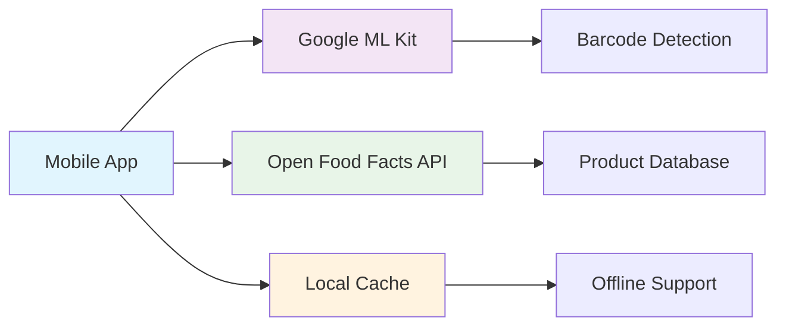

# Google ML Kit Barcode Scanning
## Executive Overview

**SMARTIES Enhancement Specification**
*Eliminating Backend Dependencies with Direct API Integration*

---

## Executive Summary

**Objective:** Replace backend-dependent barcode scanning with Google ML Kit + Open Food Facts direct integration

**Key Benefits:**
- ✅ **Zero Backend Costs** - Eliminate custom API infrastructure
- ✅ **Sub-3 Second Response** - World-class scanning performance  
- ✅ **Offline Capability** - Works without internet connection
- ✅ **2M+ Products** - Access to Open Food Facts database
- ✅ **Accessibility First** - Full screen reader support

**Timeline:** 5 weeks | **Team Size:** 2-3 developers

---

## Current State vs. Future State

| **Current** | **Future** |
|-------------|------------|
| Custom backend required | Direct API integration |
| Backend maintenance costs | Zero infrastructure costs |
| Limited offline capability | Full offline functionality |
| Basic barcode scanning | Google ML Kit performance |
| Custom API development | Open Food Facts ecosystem |

**Cost Savings:** Eliminate backend hosting, maintenance, and development costs

---

## Technical Architecture

**Key Components:**
- Google ML Kit for barcode detection
- Direct Open Food Facts API integration
- Local caching for offline functionality
- Comprehensive error handling and fallbacks

---

## Business Impact

### **User Experience Improvements**
- **Instant Feedback:** Haptic, audio, and visual confirmation
- **Smart Guidance:** Viewfinder overlay with clear instructions
- **Fallback Options:** Manual entry for damaged barcodes
- **Accessibility:** Full VoiceOver/TalkBack support

### **Operational Benefits**
- **Reduced Complexity:** No backend to maintain or scale
- **Lower Costs:** Eliminate server infrastructure expenses
- **Faster Development:** Leverage existing Open Food Facts ecosystem
- **Better Reliability:** Offline capability with local caching

---

## Key Features

### 🎯 **World-Class Scanning Experience**
- Semi-transparent viewfinder with targeting guidance
- Immediate feedback (vibration, sound, visual)
- Automatic torch control for low-light conditions
- Support for EAN-8, EAN-13, UPC-A, UPC-E formats

### 🌐 **Direct API Integration**
- Open Food Facts API (2M+ products)
- Proper API etiquette with User-Agent headers
- Product contribution workflow for missing items
- Comprehensive error handling and recovery

---

## Key Features (Continued)

### 💾 **Smart Caching System**
- 7-day TTL for product data freshness
- 100-product cache with LRU eviction
- Offline functionality with cached products
- Background refresh for stale data

### ♿ **Accessibility Excellence**
- Full screen reader compatibility
- Audio announcements for scan status
- Keyboard navigation support
- WCAG compliance validation

---

## Risk Mitigation

### **Technical Risks**
| Risk | Mitigation |
|------|------------|
| API Rate Limits | Client-side rate limiting + caching |
| Network Failures | Offline cache + retry mechanisms |
| Barcode Detection Issues | Manual entry fallback |
| Performance Problems | Optimized ML Kit configuration |

### **Business Risks**
| Risk | Mitigation |
|------|------------|
| Open Food Facts Dependency | Robust error handling + fallbacks |
| User Adoption | Comprehensive testing + accessibility |
| Data Quality | User contribution workflow |

---

## Implementation Timeline

### **Week 1: Core Foundation**
- Google ML Kit integration
- Basic barcode detection and validation
- Camera view with viewfinder overlay

### **Week 2: API Integration**
- Open Food Facts API service
- Product lookup and error handling
- Not found flow with contribution

### **Week 3: Caching & Offline**
- Local product caching system
- Offline detection and fallback
- Cache management and cleanup

---

## Implementation Timeline (Continued)

### **Week 4: Enhanced UX**
- Manual entry modal
- Accessibility improvements
- Torch control and guidance
- Performance optimization

### **Week 5: Integration & Testing**
- Dietary analysis integration
- Comprehensive testing suite
- Performance validation
- Documentation and review

---

## Success Metrics

### **Performance Targets**
- **Scan Speed:** < 3 seconds from detection to result
- **Accuracy:** > 99% barcode detection rate
- **Offline Success:** 100% for cached products
- **Accessibility:** Full WCAG compliance

### **Business Metrics**
- **Cost Reduction:** 100% backend infrastructure savings
- **User Satisfaction:** > 4.5 app store rating
- **Reliability:** < 0.1% crash rate
- **Adoption:** 90% user profile completion

---

## Quality Assurance

### **Comprehensive Testing Strategy**
- **Unit Tests:** 85% coverage minimum
- **Integration Tests:** API and cache interactions
- **BDD Scenarios:** Complete user workflows
- **Performance Tests:** Speed and memory validation
- **Accessibility Tests:** Screen reader compatibility

### **Test Pyramid Distribution**
- 60% Unit Tests (fast feedback)
- 30% Integration Tests (service interactions)
- 10% E2E Tests (complete workflows)

---

## Resource Requirements

### **Development Team**
- **Lead Developer:** Google ML Kit integration + architecture
- **Mobile Developer:** UI/UX implementation + accessibility
- **QA Engineer:** Testing strategy + automation

### **External Dependencies**
- Google ML Kit SDK (free)
- Open Food Facts API (free, open source)
- React Native camera libraries
- Testing frameworks and tools

**Total Investment:** Development time only - no infrastructure costs

---

## Competitive Advantages

### **Technical Excellence**
- Modern Google ML Kit vs. legacy scanning solutions
- Direct API integration vs. custom backend complexity
- Comprehensive offline support vs. online-only competitors
- Accessibility-first design vs. basic implementations

### **Business Benefits**
- Zero ongoing infrastructure costs
- Faster time-to-market with proven APIs
- Access to world's largest open food database
- Community-driven data quality improvements

---

## Next Steps

### **Immediate Actions**
1. **Stakeholder Approval** - Review and approve specification
2. **Team Assignment** - Allocate development resources
3. **Environment Setup** - Configure development tools
4. **Sprint Planning** - Break down tasks into sprints

### **Success Criteria**
- All requirements implemented and tested
- Performance targets achieved
- Accessibility compliance validated
- Integration with existing dietary analysis complete

---

## Questions & Discussion

### **Key Decision Points**
- Timeline approval and resource allocation
- Integration approach with existing features
- Testing strategy and quality gates
- Release planning and rollout strategy

### **Technical Considerations**
- Google ML Kit licensing and compliance
- Open Food Facts API usage guidelines
- Performance optimization priorities
- Accessibility testing approach

**Ready to eliminate backend dependencies and deliver world-class barcode scanning?**

---

## Appendix: Technical Details

### **Supported Barcode Formats**
- EAN-8, EAN-13 (European Article Numbers)
- UPC-A, UPC-E (Universal Product Codes)
- Automatic format detection and normalization

### **API Integration Specifications**
- Endpoint: `https://world.openfoodfacts.org/api/v2/product/{barcode}.json`
- User-Agent: `SMARTIES - React Native - Version X.X - https://smarties.app - scan`
- Response handling for status 1 (found) and 0 (not found)
- Network error recovery with exponential backoff

### **Cache Management**
- AsyncStorage for local persistence
- 7-day TTL with background refresh
- 100-product limit with LRU eviction
- Data integrity validation and corruption recovery