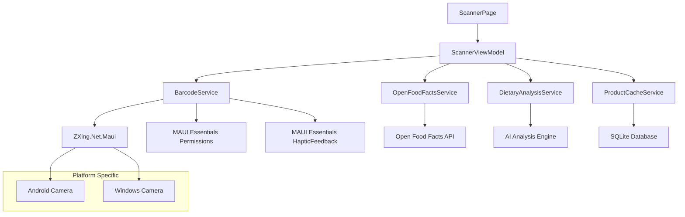

# Design Document: ZXing Barcode Scanning Implementation

## Overview

This design document outlines the implementation of real barcode scanning functionality for the SMARTIES MAUI mobile application using ZXing.Net.Maui. The solution replaces the current mock barcode scanning implementation with a fully functional camera-based barcode scanner that integrates seamlessly with the existing Open Food Facts API service and dietary analysis workflow.

The design prioritizes user experience with sub-3-second scan-to-result performance, comprehensive accessibility support, and robust error handling across Windows and Android platforms.

## Architecture

### High-Level Architecture



### Component Interaction Flow

1. **Scanner Initialization**: ScannerPage loads → ScannerViewModel requests camera permissions → BarcodeService initializes ZXing camera view
2. **Barcode Detection**: ZXing detects barcode → BarcodeService validates format → Provides haptic/audio feedback
3. **Product Lookup**: Normalized barcode → OpenFoodFactsService API call → Product data retrieval
4. **Dietary Analysis**: Product data → DietaryAnalysisService → AI-powered compliance check
5. **Result Display**: Analysis results → Navigate to ProductDetailPage → Cache results via ProductCacheService

## Components and Interfaces

### IBarcodeService Interface

```csharp
public interface IBarcodeService
{
    Task<bool> RequestCameraPermissionAsync();
    Task<string?> ScanBarcodeAsync(CancellationToken cancellationToken = default);
    Task<bool> ValidateBarcodeFormatAsync(string barcode);
    Task<string> NormalizeBarcodeAsync(string barcode);
    Task ProvideScanFeedbackAsync();
    Task<bool> IsFlashlightAvailableAsync();
    Task ToggleFlashlightAsync(bool enabled);
    event EventHandler<BarcodeDetectedEventArgs> BarcodeDetected;
}
```

**Design Rationale**: Interface-based design enables testability and platform-specific implementations while maintaining consistent API across the application.

### BarcodeService Implementation

```csharp
public class BarcodeService : IBarcodeService
{
    private readonly ILogger<BarcodeService> _logger;
    private readonly IHapticFeedback _hapticFeedback;
    private readonly IAudioService _audioService;
    private bool _isScanning;
    private DateTime _lastScanTime;
    
    // Core scanning logic with ZXing.Net.Maui integration
    // Barcode format validation and normalization
    // Haptic and audio feedback coordination
    // Flashlight control for low-light conditions
}
```

### ScannerViewModel

```csharp
public partial class ScannerViewModel : ObservableObject
{
    [ObservableProperty]
    private bool isScanning;
    
    [ObservableProperty]
    private bool isProcessing;
    
    [ObservableProperty]
    private string scanningInstructions = "Center barcode in the frame";
    
    [ObservableProperty]
    private bool isFlashlightEnabled;
    
    [RelayCommand]
    private async Task StartScanningAsync();
    
    [RelayCommand]
    private async Task StopScanningAsync();
    
    [RelayCommand]
    private async Task ManualEntryAsync();
    
    [RelayCommand]
    private async Task ToggleFlashlightAsync();
}
```

**Design Rationale**: MVVM pattern with CommunityToolkit.Mvvm for clean separation of concerns and data binding support.

### ZXing Camera View Integration

```csharp
// Custom camera view component
public class SmartiesCameraView : ContentView
{
    public static readonly BindableProperty IsScanningProperty = 
        BindableProperty.Create(nameof(IsScanning), typeof(bool), typeof(SmartiesCameraView));
    
    public bool IsScanning
    {
        get => (bool)GetValue(IsScanningProperty);
        set => SetValue(IsScanningProperty, value);
    }
    
    // ZXing configuration for optimal barcode detection
    // Overlay rendering for scanning guidance
    // Platform-specific camera optimization
}
```

## Data Models

### Barcode Detection Models

```csharp
public record BarcodeDetectedEventArgs(
    string Barcode,
    BarcodeFormat Format,
    DateTime DetectedAt,
    Rectangle BoundingBox
);

public enum BarcodeFormat
{
    EAN8,
    EAN13,
    UPCA,
    UPCE,
    Code128,
    Unknown
}

public record BarcodeValidationResult(
    bool IsValid,
    BarcodeFormat Format,
    string NormalizedBarcode,
    string? ErrorMessage = null
);
```

### Scanner State Models

```csharp
public enum ScannerState
{
    Initializing,
    Ready,
    Scanning,
    Processing,
    Error,
    PermissionDenied
}

public record ScannerConfiguration(
    bool AutoFocusEnabled = true,
    bool FlashlightAvailable = false,
    TimeSpan ScanCooldown = default,
    HashSet<BarcodeFormat> SupportedFormats = null
)
{
    public static ScannerConfiguration Default => new()
    {
        ScanCooldown = TimeSpan.FromSeconds(2),
        SupportedFormats = new HashSet<BarcodeFormat>
        {
            BarcodeFormat.EAN8,
            BarcodeFormat.EAN13,
            BarcodeFormat.UPCA,
            BarcodeFormat.UPCE,
            BarcodeFormat.Code128
        }
    };
}
```

## Error Handling

### Error Categories and Responses

| Error Type | User Experience | Technical Response | Fallback Action |
|------------|-----------------|-------------------|-----------------|
| **Camera Permission Denied** | Settings redirect dialog | Log permission denial | Manual entry mode |
| **Camera Initialization Failed** | Clear error message | Log hardware details | Manual entry mode |
| **Invalid Barcode Format** | Brief toast message | Continue scanning | Show format guidance |
| **Network Failure** | Offline mode indicator | Use cached data | Manual entry option |
| **ZXing Library Error** | Generic scanning error | Log exception details | Restart camera view |

### Error Handling Implementation

```csharp
public class ScannerErrorHandler
{
    public async Task<ScannerErrorResponse> HandleErrorAsync(Exception exception)
    {
        return exception switch
        {
            PermissionException => await HandlePermissionErrorAsync(),
            CameraException => await HandleCameraErrorAsync(),
            BarcodeFormatException => await HandleFormatErrorAsync(),
            NetworkException => await HandleNetworkErrorAsync(),
            _ => await HandleGenericErrorAsync(exception)
        };
    }
    
    private async Task<ScannerErrorResponse> HandlePermissionErrorAsync()
    {
        var result = await Shell.Current.DisplayAlert(
            "Camera Permission Required",
            "SMARTIES needs camera access to scan barcodes. Would you like to open settings?",
            "Open Settings",
            "Manual Entry");
            
        if (result)
        {
            await Launcher.OpenAsync(new Uri("app-settings:"));
        }
        
        return ScannerErrorResponse.ShowManualEntry();
    }
}
```

**Design Rationale**: Centralized error handling ensures consistent user experience and comprehensive logging for debugging and improvement.

## Testing Strategy

### Unit Testing Approach

```csharp
[TestClass]
public class BarcodeServiceTests
{
    [TestMethod]
    public async Task ValidateBarcodeFormatAsync_ValidEAN13_ReturnsTrue()
    {
        // Arrange
        var service = new BarcodeService(Mock.Of<ILogger<BarcodeService>>());
        var validEAN13 = "1234567890123";
        
        // Act
        var result = await service.ValidateBarcodeFormatAsync(validEAN13);
        
        // Assert
        Assert.IsTrue(result);
    }
    
    [TestMethod]
    public async Task NormalizeBarcodeAsync_UPCA_ConvertsToEAN13()
    {
        // Test barcode normalization logic
    }
}
```

### Integration Testing Strategy

```csharp
[TestClass]
public class ScannerIntegrationTests
{
    [TestMethod]
    public async Task ScanToProductLookup_ValidBarcode_ReturnsProductData()
    {
        // Test complete flow from barcode detection to product retrieval
        // Mock ZXing detection, verify API calls, validate data flow
    }
}
```

### Accessibility Testing

- **Screen Reader Compatibility**: Verify VoiceOver/TalkBack announcements
- **High Contrast Mode**: Test visual elements in accessibility modes
- **Voice Guidance**: Validate audio instructions and feedback
- **Keyboard Navigation**: Ensure manual entry is fully accessible

## Performance Optimization

### Camera Performance

```csharp
public class CameraOptimizationService
{
    public CameraConfiguration OptimizeForDevice()
    {
        var deviceInfo = DeviceInfo.Current;
        
        return deviceInfo.Platform switch
        {
            DevicePlatform.Android => new CameraConfiguration
            {
                Resolution = CameraResolution.Medium,
                FocusMode = CameraFocusMode.Continuous,
                FrameRate = 15 // Balance between performance and battery
            },
            DevicePlatform.WinUI => new CameraConfiguration
            {
                Resolution = CameraResolution.High,
                FocusMode = CameraFocusMode.Auto,
                FrameRate = 30
            },
            _ => CameraConfiguration.Default
        };
    }
}
```

### Battery Optimization

- **Scanning Timeout**: Auto-pause after 30 seconds of inactivity
- **Background Handling**: Immediate camera shutdown when app backgrounded
- **Frame Rate Optimization**: Adaptive frame rate based on detection success
- **CPU Throttling**: Reduce processing intensity during extended scanning sessions

### Memory Management

```csharp
public class ScannerResourceManager : IDisposable
{
    private readonly Timer _cleanupTimer;
    private readonly ConcurrentQueue<WeakReference> _frameReferences;
    
    public void OptimizeMemoryUsage()
    {
        // Cleanup old frame references
        // Trigger garbage collection if memory pressure detected
        // Release unused camera resources
    }
    
    public void Dispose()
    {
        _cleanupTimer?.Dispose();
        // Ensure all camera resources are properly released
    }
}
```

## Platform-Specific Implementations

### Android Implementation

```csharp
#if ANDROID
public class AndroidBarcodeService : BarcodeService
{
    protected override async Task<CameraConfiguration> GetOptimalCameraConfigAsync()
    {
        var cameraManager = Platform.CurrentActivity?.GetSystemService(Context.CameraService) as CameraManager;
        
        // Query camera capabilities
        // Select rear camera with autofocus
        // Configure optimal resolution and frame rate
        
        return new CameraConfiguration
        {
            CameraId = GetRearCameraId(),
            AutoFocusEnabled = true,
            FlashlightSupported = await HasFlashlightAsync()
        };
    }
}
#endif
```

### Windows Implementation

```csharp
#if WINDOWS
public class WindowsBarcodeService : BarcodeService
{
    protected override async Task<CameraConfiguration> GetOptimalCameraConfigAsync()
    {
        var devices = await DeviceInformation.FindAllAsync(DeviceClass.VideoCapture);
        var defaultCamera = devices.FirstOrDefault();
        
        return new CameraConfiguration
        {
            DeviceId = defaultCamera?.Id,
            AutoFocusEnabled = true,
            FlashlightSupported = false // Typically not available on Windows devices
        };
    }
}
#endif
```

**Design Rationale**: Platform-specific implementations handle hardware differences while maintaining consistent API through base interface.

## Security Considerations

### Privacy Protection

- **No Image Storage**: Camera frames processed in memory only, never persisted
- **Permission Transparency**: Clear explanation of camera usage in permission requests
- **Data Minimization**: Only barcode strings transmitted to APIs, no image data
- **Local Processing**: Barcode detection happens entirely on device

### Input Validation

```csharp
public class BarcodeValidator
{
    private static readonly Regex EAN13Pattern = new(@"^\d{13}$");
    private static readonly Regex UPCAPattern = new(@"^\d{12}$");
    
    public ValidationResult ValidateBarcode(string barcode, BarcodeFormat format)
    {
        if (string.IsNullOrWhiteSpace(barcode))
            return ValidationResult.Invalid("Barcode cannot be empty");
            
        return format switch
        {
            BarcodeFormat.EAN13 => ValidateEAN13(barcode),
            BarcodeFormat.UPCA => ValidateUPCA(barcode),
            _ => ValidationResult.Valid()
        };
    }
    
    private ValidationResult ValidateEAN13(string barcode)
    {
        if (!EAN13Pattern.IsMatch(barcode))
            return ValidationResult.Invalid("Invalid EAN-13 format");
            
        // Implement checksum validation
        return ValidateChecksum(barcode) 
            ? ValidationResult.Valid() 
            : ValidationResult.Invalid("Invalid checksum");
    }
}
```

## Integration Points

### Open Food Facts API Integration

```csharp
public async Task<Product?> ProcessScannedBarcodeAsync(string barcode)
{
    try
    {
        // Normalize barcode format
        var normalizedBarcode = await _barcodeService.NormalizeBarcodeAsync(barcode);
        
        // Call existing OpenFoodFactsService
        var product = await _openFoodFactsService.GetProductAsync(normalizedBarcode);
        
        if (product != null)
        {
            // Cache for offline access
            await _productCacheService.CacheProductAsync(product);
            
            // Trigger dietary analysis
            var analysis = await _dietaryAnalysisService.AnalyzeProductAsync(product, _userProfile);
            
            // Navigate to results
            await Shell.Current.GoToAsync($"//productdetail?barcode={normalizedBarcode}");
        }
        
        return product;
    }
    catch (Exception ex)
    {
        _logger.LogError(ex, "Failed to process scanned barcode {Barcode}", barcode);
        await _errorHandler.HandleErrorAsync(ex);
        return null;
    }
}
```

### Existing Service Integration

- **UserProfileService**: Retrieve current dietary restrictions for analysis
- **ProductCacheService**: Store scanned products for offline access
- **DietaryAnalysisService**: Analyze products against user restrictions
- **NavigationService**: Handle page transitions and result display

## Deployment Considerations

### Package Dependencies

```xml
<PackageReference Include="ZXing.Net.Maui" Version="0.4.0" />
<PackageReference Include="ZXing.Net.Maui.Controls" Version="0.4.0" />
<PackageReference Include="CommunityToolkit.Maui" Version="7.0.1" />
```

### Platform Permissions

**Android (Platforms/Android/AndroidManifest.xml)**:
```xml
<uses-permission android:name="android.permission.CAMERA" />
<uses-permission android:name="android.permission.FLASHLIGHT" />
<uses-feature android:name="android.hardware.camera" android:required="true" />
<uses-feature android:name="android.hardware.camera.autofocus" android:required="false" />
```

**Windows (Platforms/Windows/Package.appxmanifest)**:
```xml
<Capabilities>
  <DeviceCapability Name="webcam" />
</Capabilities>
```

### Build Configuration

```csharp
// MauiProgram.cs
public static MauiApp CreateMauiApp()
{
    var builder = MauiApp.CreateBuilder();
    builder
        .UseMauiApp<App>()
        .UseBarcodeReader() // ZXing.Net.Maui
        .UseMauiCommunityToolkit();
        
    // Register barcode scanning services
    builder.Services.AddSingleton<IBarcodeService, BarcodeService>();
    builder.Services.AddTransient<ScannerViewModel>();
    
    return builder.Build();
}
```

## Monitoring and Analytics

### Performance Metrics

- **Scan Success Rate**: Percentage of successful barcode detections
- **Scan Duration**: Time from camera activation to barcode detection
- **API Response Time**: Open Food Facts API call performance
- **Error Rates**: Categorized by error type for improvement insights

### User Experience Metrics

- **Accessibility Usage**: Screen reader and voice guidance utilization
- **Manual Entry Fallback**: Frequency of manual entry usage
- **Flashlight Usage**: Low-light scanning patterns
- **Battery Impact**: Power consumption during scanning sessions

This design provides a comprehensive foundation for implementing robust, accessible, and performant barcode scanning functionality that integrates seamlessly with the existing SMARTIES application architecture.