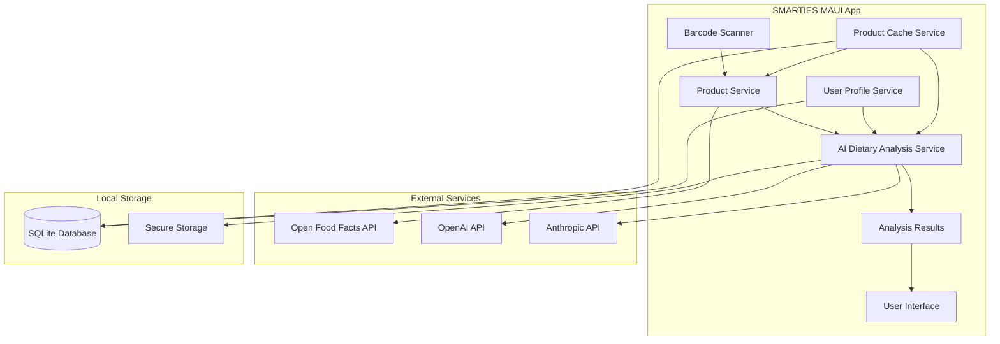

# AI Dietary Analysis Design Document

## Overview

This design document outlines the implementation of AI-powered dietary analysis functionality for the SMARTIES MAUI mobile application. The system will replace the current mock dietary analysis with a fully functional AI service that integrates with OpenAI or Anthropic APIs to provide intelligent dietary compliance checking against user dietary restrictions.

The AI dietary analysis system will analyze product ingredients, allergens, and nutritional information against user profiles to provide detailed safety assessments with appropriate severity levels and actionable recommendations. The system prioritizes user safety with zero false negatives for critical restrictions while maintaining fast response times and offline capability.

## Architecture

### High-Level Architecture



### Service Layer Architecture

The AI dietary analysis system follows a layered architecture with clear separation of concerns:

1. **Presentation Layer**: ViewModels and Views for displaying analysis results
2. **Application Layer**: Orchestration services and business logic
3. **Domain Layer**: Core business entities and rules
4. **Infrastructure Layer**: External API integrations and data persistence

### Design Rationale

- **AI-First Approach**: Leverages advanced language models for nuanced dietary analysis beyond simple keyword matching
- **Fallback Strategy**: Maintains rule-based analysis for offline scenarios and API failures
- **Configurable AI Providers**: Supports both OpenAI and Anthropic for flexibility and cost optimization
- **Privacy-Focused**: Minimizes data sent to external services while maintaining analysis quality

## Components and Interfaces

### Core Services

#### IDietaryAnalysisService
```csharp
public interface IDietaryAnalysisService
{
    Task<DietaryAnalysis> AnalyzeProductAsync(Product product, UserProfile userProfile, CancellationToken cancellationToken = default);
    Task<DietaryAnalysis> AnalyzeProductOfflineAsync(Product product, UserProfile userProfile);
    Task<bool> ValidateApiConfigurationAsync();
}
```

#### IAIProviderService
```csharp
public interface IAIProviderService
{
    Task<AIAnalysisResponse> AnalyzeIngredientsAsync(AIAnalysisRequest request, CancellationToken cancellationToken = default);
    bool IsConfigured { get; }
    string ProviderName { get; }
}
```

#### IOpenAIService : IAIProviderService
```csharp
public interface IOpenAIService : IAIProviderService
{
    Task<OpenAIResponse> SendChatCompletionAsync(OpenAIRequest request, CancellationToken cancellationToken = default);
}
```

#### IAnthropicService : IAIProviderService
```csharp
public interface IAnthropicService : IAIProviderService
{
    Task<AnthropicResponse> SendMessageAsync(AnthropicRequest request, CancellationToken cancellationToken = default);
}
```

#### IRuleBasedAnalysisService
```csharp
public interface IRuleBasedAnalysisService
{
    DietaryAnalysis AnalyzeProduct(Product product, UserProfile userProfile);
    bool CanAnalyzeRestriction(DietaryRestrictionType restrictionType);
    Task<List<DietaryAnalysis>> QueuePendingAnalysesAsync();
    Task ProcessQueuedAnalysesAsync(CancellationToken cancellationToken = default);
}

#### IComplianceTrackingService
```csharp
public interface IComplianceTrackingService
{
    Task<ComplianceTracking> GetComplianceHistoryAsync(string userId, DateTime fromDate, DateTime toDate);
    Task RecordComplianceEntryAsync(ComplianceEntry entry);
    Task<Dictionary<string, double>> CalculateComplianceScoresAsync(string userId);
    Task<List<string>> GetComplianceTrendsAsync(string userId);
    Task<bool> ShouldReanalyzeProductAsync(string productBarcode, string userProfileHash);
}
```

### Data Models

#### DietaryAnalysis
```csharp
public class DietaryAnalysis
{
    public string ProductBarcode { get; set; } = string.Empty;
    public string ProductName { get; set; } = string.Empty;
    public bool IsSafe { get; set; }
    public ComplianceLevel OverallCompliance { get; set; }
    public string Summary { get; set; } = string.Empty;
    public List<DietaryViolation> Violations { get; set; } = new();
    public List<DietaryWarning> Warnings { get; set; } = new();
    public List<string> PositiveAspects { get; set; } = new();
    public List<string> Recommendations { get; set; } = new();
    public DateTime AnalyzedAt { get; set; }
    public string AnalysisMethod { get; set; } = string.Empty; // "AI", "RuleBased", "Cached"
    public double ConfidenceScore { get; set; }
    public string AIModelVersion { get; set; } = string.Empty;
}
```

#### DietaryViolation
```csharp
public class DietaryViolation
{
    public string RestrictionName { get; set; } = string.Empty;
    public DietaryRestrictionType RestrictionType { get; set; }
    public ViolationType ViolationType { get; set; }
    public string ViolatingIngredient { get; set; } = string.Empty;
    public string Explanation { get; set; } = string.Empty;
    public SeverityLevel Severity { get; set; }
    public double ConfidenceScore { get; set; }
    public string HealthImpactInfo { get; set; } = string.Empty; // For medical restrictions
    public Dictionary<string, object> QuantitativeData { get; set; } = new(); // Sodium mg, sugar g, etc.
}
```

#### DietaryWarning
```csharp
public class DietaryWarning
{
    public string RestrictionName { get; set; } = string.Empty;
    public DietaryRestrictionType RestrictionType { get; set; }
    public string WarningMessage { get; set; } = string.Empty;
    public string RiskLevel { get; set; } = string.Empty;
    public List<string> Alternatives { get; set; } = new();
    public double ConfidenceScore { get; set; }
}
```

#### AIAnalysisRequest
```csharp
public class AIAnalysisRequest
{
    public string ProductName { get; set; } = string.Empty;
    public string IngredientsText { get; set; } = string.Empty;
    public string AllergenStatement { get; set; } = string.Empty;
    public List<UserDietaryRestriction> UserRestrictions { get; set; } = new();
    public NutritionFacts? NutritionFacts { get; set; }
    public string Categories { get; set; } = string.Empty;
    public string CertificationLabels { get; set; } = string.Empty; // Halal, Kosher, Organic symbols
}

public class UserDietaryRestriction
{
    public string Name { get; set; } = string.Empty;
    public DietaryRestrictionType Type { get; set; }
    public SeverityLevel Severity { get; set; }
    public Dictionary<string, object> Parameters { get; set; } = new(); // Thresholds, preferences
}
```

### Enumerations

```csharp
public enum ComplianceLevel
{
    Safe,
    Caution,
    Warning,
    Violation,
    Critical
}

public enum ViolationType
{
    DirectIngredient,
    CrossContamination,
    ProcessingAid,
    HiddenAllergen,
    NutritionalConcern,
    ReligiousViolation,
    LifestyleIncompatible
}

public enum SeverityLevel
{
    Low,
    Medium,
    High,
    Critical
}

public enum DietaryRestrictionType
{
    Allergy,
    Religious,
    Medical,
    Lifestyle
}
```

## Data Models

### AI Provider Configuration

The system supports multiple AI providers with secure configuration management:

```csharp
public class AIProviderConfiguration
{
    public string ProviderName { get; set; } = string.Empty;
    public string ApiKey { get; set; } = string.Empty;
    public string BaseUrl { get; set; } = string.Empty;
    public string ModelName { get; set; } = string.Empty;
    public int MaxTokens { get; set; } = 1000;
    public double Temperature { get; set; } = 0.1;
    public int TimeoutSeconds { get; set; } = 30;
    public bool IsEnabled { get; set; } = true;
}
```

### Analysis Cache

To support offline functionality and improve performance:

```csharp
public class AnalysisCache
{
    public string ProductBarcode { get; set; } = string.Empty;
    public string UserProfileHash { get; set; } = string.Empty;
    public DietaryAnalysis Analysis { get; set; } = new();
    public DateTime CachedAt { get; set; }
    public DateTime ExpiresAt { get; set; }
    public string AnalysisVersion { get; set; } = string.Empty;
    public bool IsEncrypted { get; set; } = true;
}

public class ComplianceTracking
{
    public string UserId { get; set; } = string.Empty;
    public DateTime TrackingDate { get; set; }
    public List<ComplianceEntry> Entries { get; set; } = new();
    public Dictionary<string, double> ComplianceScores { get; set; } = new();
}

public class ComplianceEntry
{
    public string ProductBarcode { get; set; } = string.Empty;
    public string ProductName { get; set; } = string.Empty;
    public ComplianceLevel ComplianceLevel { get; set; }
    public List<string> ViolatedRestrictions { get; set; } = new();
    public DateTime ScannedAt { get; set; }
}
```

### Prompt Templates

Structured prompts for consistent AI analysis:

```csharp
public class AnalysisPromptTemplate
{
    public string SystemPrompt { get; set; } = string.Empty;
    public string UserPromptTemplate { get; set; } = string.Empty;
    public string ResponseFormat { get; set; } = string.Empty;
    public List<string> RequiredFields { get; set; } = new();
}
```

## Error Handling

### Error Handling Strategy

The system implements a comprehensive error handling strategy with graceful degradation:

1. **API Failures**: Automatic fallback to rule-based analysis
2. **Network Issues**: Use cached results when available
3. **Rate Limiting**: Exponential backoff with jitter
4. **Invalid Responses**: Retry with simplified prompts
5. **Configuration Errors**: Clear user guidance for setup

### Exception Hierarchy

```csharp
public class DietaryAnalysisException : Exception
{
    public string ProductBarcode { get; }
    public DietaryAnalysisException(string productBarcode, string message) : base(message)
    {
        ProductBarcode = productBarcode;
    }
}

public class AIProviderException : DietaryAnalysisException
{
    public string ProviderName { get; }
    public int? StatusCode { get; }
    public AIProviderException(string productBarcode, string providerName, string message, int? statusCode = null) 
        : base(productBarcode, message)
    {
        ProviderName = providerName;
        StatusCode = statusCode;
    }
}

public class ConfigurationException : Exception
{
    public string ConfigurationKey { get; }
    public ConfigurationException(string configurationKey, string message) : base(message)
    {
        ConfigurationKey = configurationKey;
    }
}
```

### Retry Logic

```csharp
public class RetryPolicy
{
    public int MaxRetries { get; set; } = 3;
    public TimeSpan InitialDelay { get; set; } = TimeSpan.FromSeconds(1);
    public TimeSpan MaxDelay { get; set; } = TimeSpan.FromSeconds(30);
    public double BackoffMultiplier { get; set; } = 2.0;
    public bool UseJitter { get; set; } = true;
}
```

## Testing Strategy

### Unit Testing Approach

The testing strategy focuses on critical safety paths and edge cases:

1. **AI Service Testing**: Mock AI providers for consistent testing
2. **Rule-Based Testing**: Comprehensive coverage of dietary restriction logic
3. **Error Handling Testing**: Simulate various failure scenarios
4. **Performance Testing**: Validate response times and memory usage
5. **Security Testing**: Ensure API keys and user data protection

### Test Categories

#### Critical Safety Tests
- Zero false negatives for severe allergies
- Correct severity classification for medical restrictions
- Proper handling of cross-contamination warnings
- Accurate religious compliance checking

#### Integration Tests
- End-to-end analysis workflow
- AI provider integration
- Offline fallback scenarios
- Cache invalidation and refresh

#### Performance Tests
- Analysis response time under load
- Memory usage during batch processing
- Network timeout handling
- Concurrent analysis requests

### Mock Data Strategy

```csharp
public class MockAIProvider : IAIProviderService
{
    private readonly Dictionary<string, AIAnalysisResponse> _mockResponses;
    
    public async Task<AIAnalysisResponse> AnalyzeIngredientsAsync(AIAnalysisRequest request, CancellationToken cancellationToken = default)
    {
        // Return predefined responses for testing
        var key = GenerateRequestKey(request);
        return _mockResponses.TryGetValue(key, out var response) 
            ? response 
            : CreateDefaultResponse(request);
    }
}
```

## Implementation Details

### AI Prompt Engineering

The system uses carefully crafted prompts to ensure consistent and accurate analysis:

#### System Prompt Template
```
You are a dietary compliance expert analyzing food products for safety. Your analysis must be:
1. Accurate and conservative (err on the side of caution)
2. Specific about ingredients causing violations
3. Clear about severity levels
4. Helpful with actionable recommendations
5. Prioritize medical and allergy restrictions over lifestyle preferences
6. Check for hidden allergens in compound ingredients
7. Parse "Contains:" and "May contain:" statements for cross-contamination
8. Provide quantitative data when available (sodium mg, sugar g)
9. Respect certification labels (Halal, Kosher symbols) over ingredient analysis
10. Explain religious compliance context and suggest certification verification

Analyze the product against the user's dietary restrictions and respond in JSON format with consistent scoring.
```

#### Specialized Prompt Templates

**Allergy Analysis Prompt:**
```
Focus on allergen detection:
- Direct ingredient matches (e.g., "milk" for dairy allergy)
- Hidden allergens in compounds (e.g., "whey" contains dairy)
- Cross-contamination risks from "Contains:" and "May contain:" statements
- Classify as DirectIngredient, CrossContamination, or ProcessingAid
- Set Critical or Violation compliance for severe allergens
```

**Religious Compliance Prompt:**
```
Analyze religious dietary compliance:
- Halal: Check for pork, alcohol, non-halal meat sources
- Kosher: Check for non-kosher ingredients, meat/dairy combinations
- Hindu vegetarian: Check for meat, fish, eggs, animal-derived ingredients
- Provide context about why ingredients violate restrictions
- Note positive compliance and suggest certification verification
```

**Medical Restrictions Prompt:**
```
Analyze medical dietary requirements:
- Diabetes: Sugar content, carbohydrates, glycemic impact
- Hypertension: Sodium content, salt levels, blood pressure effects
- Celiac: Gluten grains, cross-contamination, hidden gluten
- Include specific health impact information
- Provide quantitative data from nutrition facts when available
```

#### Analysis Workflow

1. **Input Validation**: Verify product data completeness
2. **Restriction Prioritization**: Order by severity (Medical > Allergy > Religious > Lifestyle)
3. **AI Analysis**: Send structured request to configured provider
4. **Response Validation**: Ensure response format and completeness
5. **Confidence Scoring**: Assess analysis reliability
6. **Result Caching**: Store for offline access

### Configuration Management

API keys and sensitive configuration are stored securely using MAUI Essentials SecureStorage:

```csharp
public class SecureConfigurationService
{
    public async Task<string?> GetApiKeyAsync(string providerName)
    {
        return await SecureStorage.GetAsync($"ai_provider_{providerName}_key");
    }
    
    public async Task SetApiKeyAsync(string providerName, string apiKey)
    {
        await SecureStorage.SetAsync($"ai_provider_{providerName}_key", apiKey);
    }
}
```

### Offline Analysis Strategy

When AI services are unavailable, the system falls back to rule-based analysis:

1. **Allergen Detection**: Keyword matching against known allergen lists
2. **Religious Compliance**: Check against prohibited ingredient databases
3. **Medical Restrictions**: Basic nutritional threshold checking
4. **Confidence Scoring**: Lower confidence scores for rule-based results

### Performance Optimizations

1. **Request Batching**: Combine multiple restrictions in single AI call
2. **Response Caching**: Cache results by product and user profile hash
3. **Lazy Loading**: Load AI providers only when needed
4. **Connection Pooling**: Reuse HTTP connections for API calls
5. **Compression**: Use gzip compression for API requests

### Privacy and Security Measures

1. **Data Minimization**: Send only necessary product information to AI services
2. **Anonymization**: Remove personally identifiable information from requests
3. **Encryption**: Encrypt cached analysis results
4. **Audit Logging**: Log API usage without sensitive data
5. **Secure Storage**: Use device keychain for API keys

This design provides a robust, scalable, and secure foundation for AI-powered dietary analysis while maintaining the safety-first principles of the SMARTIES application.