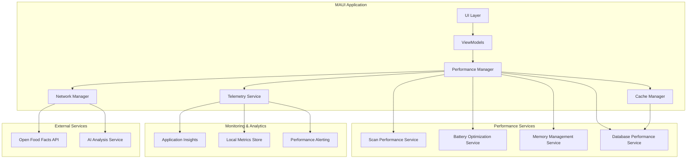

# Performance Monitoring Design Document

## Overview

This design document outlines the implementation of comprehensive performance optimization and monitoring for the SMARTIES MAUI mobile application. The solution focuses on achieving sub-3-second scan-to-result times, optimizing battery usage, implementing intelligent caching strategies, and establishing robust performance monitoring capabilities.

The design follows a multi-layered approach combining client-side optimization, intelligent caching, adaptive network handling, and comprehensive telemetry collection to ensure optimal user experience across varying device capabilities and network conditions.

## Architecture

### High-Level Architecture



### Performance Monitoring Architecture

The performance monitoring system is built around three core pillars:

1. **Real-time Performance Tracking**: Continuous monitoring of key performance metrics
2. **Adaptive Optimization**: Dynamic adjustment based on device capabilities and conditions  
3. **Comprehensive Telemetry**: Detailed logging and analytics for performance insights

## Components and Interfaces

### Core Performance Services

#### IPerformanceManager
```csharp
public interface IPerformanceManager
{
    Task<PerformanceMetrics> GetCurrentMetricsAsync();
    Task OptimizeForDeviceAsync(DeviceCapabilities capabilities);
    Task<bool> MeetsPerformanceTargetsAsync(PerformanceTargets targets);
    event EventHandler<PerformanceThresholdExceededEventArgs> ThresholdExceeded;
}
```

**Design Rationale**: Centralized performance management allows for coordinated optimization across all application components while providing a single point of control for performance-related decisions.

#### IScanPerformanceService
```csharp
public interface IScanPerformanceService
{
    Task<ScanPerformanceResult> OptimizeScanWorkflowAsync(ScanRequest request);
    Task<TimeSpan> MeasureScanToResultTimeAsync(string barcode);
    Task PreloadCriticalResourcesAsync();
    Task<CameraOptimizationSettings> GetOptimalCameraSettingsAsync();
}
```

**Design Rationale**: Dedicated scan performance service ensures the critical scan-to-result workflow meets the <3-second requirement through targeted optimizations and resource preloading.

#### IBatteryOptimizationService
```csharp
public interface IBatteryOptimizationService
{
    Task<BatteryOptimizationSettings> GetOptimalSettingsAsync();
    Task OptimizeCameraUsageAsync(CameraSession session);
    Task ReduceBackgroundProcessingAsync();
    Task<double> EstimateBatteryImpactAsync(TimeSpan duration);
    Task<bool> ShouldEnterPowerSaveModeAsync();
}
```

**Design Rationale**: Battery optimization is critical for mobile applications. This service provides centralized battery management with the goal of maintaining <5% battery drain per hour during active scanning.

#### IIntelligentCacheService
```csharp
public interface IIntelligentCacheService
{
    Task<T> GetOrFetchAsync<T>(string key, Func<Task<T>> fetchFunc, CachePolicy policy);
    Task PreloadFrequentlyAccessedDataAsync();
    Task<CacheStatistics> GetCacheStatisticsAsync();
    Task OptimizeCacheSizeAsync(long availableStorage);
    Task InvalidateStaleDataAsync();
}
```

**Design Rationale**: Intelligent caching reduces network requests and improves response times. The service implements LRU eviction and predictive preloading to maximize cache effectiveness.

#### IAdaptiveNetworkService
```csharp
public interface IAdaptiveNetworkService
{
    Task<NetworkQuality> AssessNetworkQualityAsync();
    Task<T> ExecuteWithAdaptiveTimeoutAsync<T>(Func<Task<T>> operation, NetworkQuality quality);
    Task QueueOperationAsync(NetworkOperation operation);
    Task ProcessQueuedOperationsAsync();
    Task<CompressionSettings> GetOptimalCompressionAsync();
}
```

**Design Rationale**: Network conditions vary significantly on mobile devices. This service adapts timeout values, implements request queuing, and optimizes data transfer based on current network quality.

### Performance Monitoring Components

#### IPerformanceTelemetryService
```csharp
public interface IPerformanceTelemetryService
{
    Task TrackScanPerformanceAsync(ScanPerformanceMetrics metrics);
    Task TrackApiResponseTimeAsync(string endpoint, TimeSpan responseTime);
    Task TrackMemoryUsageAsync(MemoryMetrics metrics);
    Task TrackBatteryImpactAsync(BatteryMetrics metrics);
    Task TrackUserExperienceMetricAsync(string metric, double value);
    Task FlushTelemetryAsync();
}
```

**Design Rationale**: Comprehensive telemetry collection enables data-driven performance optimization and proactive issue detection. The service batches telemetry data to minimize performance impact.

#### IPerformanceAlerting
```csharp
public interface IPerformanceAlerting
{
    Task<bool> CheckPerformanceThresholdsAsync(PerformanceMetrics metrics);
    Task TriggerPerformanceAlertAsync(PerformanceAlert alert);
    Task<List<PerformanceRecommendation>> GetOptimizationRecommendationsAsync();
}
```

**Design Rationale**: Proactive alerting helps identify performance issues before they impact users. The service provides actionable recommendations for performance improvements.

## Data Models

### Performance Metrics Models

```csharp
public class PerformanceMetrics
{
    public TimeSpan ScanToResultTime { get; set; }
    public TimeSpan ApiResponseTime { get; set; }
    public double MemoryUsageMB { get; set; }
    public double CpuUsagePercent { get; set; }
    public double BatteryDrainRate { get; set; }
    public int CacheHitRate { get; set; }
    public NetworkQuality NetworkQuality { get; set; }
    public DateTime Timestamp { get; set; }
}

public class DeviceCapabilities
{
    public DevicePerformanceTier PerformanceTier { get; set; }
    public long AvailableMemoryMB { get; set; }
    public long AvailableStorageMB { get; set; }
    public BatteryLevel BatteryLevel { get; set; }
    public bool IsLowPowerModeEnabled { get; set; }
    public CameraCapabilities CameraCapabilities { get; set; }
}

public class CachePolicy
{
    public TimeSpan ExpirationTime { get; set; }
    public CacheEvictionStrategy EvictionStrategy { get; set; }
    public int MaxSizeBytes { get; set; }
    public bool AllowBackgroundRefresh { get; set; }
    public CachePriority Priority { get; set; }
}
```

**Design Rationale**: Structured data models enable consistent performance tracking and provide clear contracts for performance-related operations.

### Performance Targets

```csharp
public class PerformanceTargets
{
    public static readonly PerformanceTargets Default = new()
    {
        MaxScanToResultTime = TimeSpan.FromSeconds(3),
        MaxCachedResultTime = TimeSpan.FromSeconds(1),
        MaxApiResponseTime = TimeSpan.FromSeconds(2),
        MaxAppStartupTime = TimeSpan.FromSeconds(2),
        MaxBatteryDrainPerHour = 5.0,
        MinCacheHitRate = 80
    };
    
    public TimeSpan MaxScanToResultTime { get; set; }
    public TimeSpan MaxCachedResultTime { get; set; }
    public TimeSpan MaxApiResponseTime { get; set; }
    public TimeSpan MaxAppStartupTime { get; set; }
    public double MaxBatteryDrainPerHour { get; set; }
    public int MinCacheHitRate { get; set; }
}
```

## Error Handling

### Performance Degradation Handling

The system implements a multi-tier approach to handle performance degradation:

1. **Graceful Degradation**: When performance targets are not met, the system automatically reduces quality settings or switches to offline mode
2. **Progressive Timeout**: Adaptive timeout values based on network quality and historical performance
3. **Fallback Strategies**: Alternative workflows when primary optimization strategies fail
4. **User Communication**: Clear progress indicators and performance feedback

### Error Recovery Patterns

```csharp
public class PerformanceRecoveryService
{
    public async Task<RecoveryAction> DetermineRecoveryActionAsync(PerformanceIssue issue)
    {
        return issue.Type switch
        {
            PerformanceIssueType.SlowScanResponse => RecoveryAction.EnableOfflineMode,
            PerformanceIssueType.HighMemoryUsage => RecoveryAction.ClearNonEssentialCache,
            PerformanceIssueType.BatteryDrain => RecoveryAction.ActivatePowerSaveMode,
            PerformanceIssueType.NetworkTimeout => RecoveryAction.QueueForRetry,
            _ => RecoveryAction.ShowUserGuidance
        };
    }
}
```

**Design Rationale**: Automated recovery reduces user friction and maintains application usability even when performance issues occur.

## Testing Strategy

### Performance Testing Framework

The testing strategy encompasses multiple levels of performance validation:

#### Unit Performance Tests
- Individual component performance benchmarks
- Memory allocation and garbage collection testing
- Cache efficiency validation
- Database query performance verification

#### Integration Performance Tests
- End-to-end scan workflow timing
- API response time validation under various network conditions
- Battery usage measurement during extended scanning sessions
- Memory usage patterns during typical user workflows

#### Load and Stress Testing
- Concurrent scanning operations
- Large dataset cache management
- Network failure recovery testing
- Device resource exhaustion scenarios

#### Device-Specific Testing
- Performance validation across different device tiers
- Battery optimization effectiveness on various devices
- Memory management on low-memory devices
- Network adaptation on different connection types

### Performance Benchmarking

```csharp
[Fact]
public async Task ScanWorkflow_ShouldCompleteWithinThreeSeconds()
{
    // Arrange
    var stopwatch = Stopwatch.StartNew();
    var barcode = "1234567890123";
    
    // Act
    var result = await _scanPerformanceService.OptimizeScanWorkflowAsync(
        new ScanRequest { Barcode = barcode });
    
    stopwatch.Stop();
    
    // Assert
    Assert.True(stopwatch.Elapsed < TimeSpan.FromSeconds(3));
    Assert.True(result.IsSuccessful);
}
```

**Design Rationale**: Automated performance testing ensures that performance requirements are continuously validated and regressions are caught early in the development process.

## Implementation Considerations

### Device Capability Detection

The system implements intelligent device capability detection to optimize performance based on hardware characteristics:

```csharp
public class DeviceCapabilityDetector
{
    public async Task<DeviceCapabilities> DetectCapabilitiesAsync()
    {
        var deviceInfo = DeviceInfo.Current;
        var memoryInfo = await GetMemoryInfoAsync();
        var batteryInfo = Battery.Current;
        
        return new DeviceCapabilities
        {
            PerformanceTier = DeterminePerformanceTier(deviceInfo, memoryInfo),
            AvailableMemoryMB = memoryInfo.AvailableMemory / 1024 / 1024,
            BatteryLevel = batteryInfo.ChargeLevel > 0.2 ? BatteryLevel.Normal : BatteryLevel.Low,
            IsLowPowerModeEnabled = batteryInfo.PowerSource == BatteryPowerSource.Battery && 
                                   batteryInfo.ChargeLevel < 0.2
        };
    }
}
```

### Adaptive Performance Settings

Based on device capabilities, the system adjusts performance settings:

- **High-End Devices**: Full feature set with maximum quality settings
- **Mid-Range Devices**: Balanced settings with selective optimization
- **Low-End Devices**: Aggressive optimization with reduced feature complexity

### Memory Management Strategy

The application implements proactive memory management:

1. **Object Pooling**: Reuse frequently allocated objects
2. **Lazy Loading**: Load resources only when needed
3. **Weak References**: Prevent memory leaks in event handlers
4. **Garbage Collection Optimization**: Minimize GC pressure through careful allocation patterns

### Network Optimization Techniques

1. **Request Compression**: Compress API requests and responses
2. **Connection Pooling**: Reuse HTTP connections
3. **Parallel Requests**: Execute independent requests concurrently
4. **Request Batching**: Combine multiple small requests when possible

**Design Rationale**: These optimizations collectively ensure that the application meets performance targets while providing a smooth user experience across diverse device and network conditions.

The design prioritizes user safety by ensuring that performance optimizations never compromise the accuracy of dietary analysis, maintaining the core principle that performance improvements should enhance rather than replace the fundamental safety features of the application.