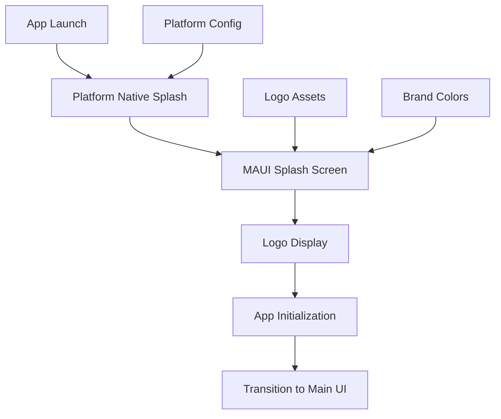

# Design Document

## Overview

This design document outlines the implementation of a branded splash screen for the SMARTIES mobile application. The splash screen will leverage .NET MAUI's built-in splash screen capabilities while incorporating the SMARTIES brand identity through the existing logo assets and design system.

The implementation will focus on platform-native splash screen mechanisms to ensure optimal performance and user experience, while maintaining consistency across Android and Windows platforms. The design emphasizes accessibility, responsive layout, and smooth transitions to the main application interface.

## Architecture

### High-Level Architecture

The splash screen implementation follows MAUI's declarative resource-based approach, utilizing the existing `MauiSplashScreen` configuration in the project file. The architecture consists of three main layers:

1. **Resource Layer**: Logo assets and platform-specific splash screen resources
2. **Configuration Layer**: MAUI project file configuration and platform-specific settings
3. **Transition Layer**: Application startup coordination and smooth transition handling



### Component Interaction

The splash screen integrates with several existing MAUI components:

- **MauiProgram.cs**: Application initialization and service registration
- **App.xaml.cs**: Application lifecycle management
- **Platform-specific configurations**: Android and Windows splash screen settings
- **Resource management**: Logo assets and styling resources

## Components and Interfaces

### Core Components

#### 1. Splash Screen Resource Configuration
**Location**: `SMARTIES.MAUI.csproj`
**Purpose**: Declarative splash screen configuration using MAUI's built-in capabilities

```xml
<MauiSplashScreen Include="Resources\Splash\smarties_splash_logo.svg" 
                  Color="#FFFFFF" 
                  BaseSize="200,200" />
```

#### 2. Logo Asset Management
**Location**: `Resources/Splash/`
**Purpose**: Centralized logo asset storage with multiple format support

**Assets Required**:
- `smarties_splash_logo.svg` - Vector format for scalability
- `smarties_splash_logo.png` - Raster fallback (multiple densities)

#### 3. Platform-Specific Configurations

**Android Configuration**
**Location**: `Platforms/Android/`
**Files**: 
- `Resources/values/colors.xml` - Splash screen colors
- `Resources/drawable/` - Platform-specific splash assets

**Windows Configuration**
**Location**: `Platforms/Windows/`
**Files**:
- `Package.appxmanifest` - Windows splash screen configuration

#### 4. Startup Performance Integration
**Location**: `Services/Performance/IStartupPerformanceService.cs`
**Purpose**: Monitor and optimize splash screen timing

### Interface Definitions

#### ISplashScreenService
```csharp
public interface ISplashScreenService
{
    Task InitializeAsync();
    Task<TimeSpan> GetMinimumDisplayTimeAsync();
    Task<bool> IsAppReadyAsync();
    event EventHandler<SplashScreenEventArgs> SplashScreenCompleted;
}
```

#### SplashScreenEventArgs
```csharp
public class SplashScreenEventArgs : EventArgs
{
    public TimeSpan DisplayDuration { get; set; }
    public bool WasMinimumTimeMet { get; set; }
    public DateTime StartTime { get; set; }
    public DateTime EndTime { get; set; }
}
```

## Data Models

### Splash Screen Configuration Model

```csharp
public class SplashScreenConfiguration
{
    public TimeSpan MinimumDisplayTime { get; set; } = TimeSpan.FromSeconds(1);
    public TimeSpan MaximumDisplayTime { get; set; } = TimeSpan.FromSeconds(3);
    public string LogoAssetPath { get; set; } = "smarties_splash_logo.svg";
    public Color BackgroundColor { get; set; } = Colors.White;
    public bool ShowLoadingIndicator { get; set; } = true;
    public TimeSpan LoadingIndicatorDelay { get; set; } = TimeSpan.FromSeconds(2);
}
```

### Performance Metrics Model

```csharp
public class SplashScreenMetrics
{
    public DateTime LaunchTime { get; set; }
    public DateTime SplashStartTime { get; set; }
    public DateTime SplashEndTime { get; set; }
    public DateTime AppReadyTime { get; set; }
    public TimeSpan TotalSplashDuration => SplashEndTime - SplashStartTime;
    public TimeSpan AppInitializationTime => AppReadyTime - SplashStartTime;
    public string Platform { get; set; } = DeviceInfo.Platform.ToString();
    public string DeviceModel { get; set; } = DeviceInfo.Model;
}
```

## Error Handling

### Error Scenarios and Mitigation

#### 1. Logo Asset Loading Failures
**Scenario**: Logo file missing or corrupted
**Mitigation**: 
- Fallback to text-based splash screen with app name
- Log error for debugging
- Continue with app initialization

```csharp
public async Task<bool> ValidateLogoAssetAsync()
{
    try
    {
        var logoExists = await FileSystem.Current.OpenAppPackageFileAsync("smarties_splash_logo.svg");
        return logoExists != null;
    }
    catch (Exception ex)
    {
        _logger.LogWarning("Logo asset validation failed: {Error}", ex.Message);
        return false;
    }
}
```

#### 2. Extended Loading Times
**Scenario**: App initialization takes longer than expected
**Mitigation**:
- Display loading indicator after 2-second threshold
- Implement timeout mechanism (10 seconds maximum)
- Graceful transition to error screen if needed

#### 3. Platform-Specific Failures
**Scenario**: Platform splash screen configuration issues
**Mitigation**:
- Platform-specific error handling
- Fallback to MAUI-managed splash screen
- Detailed logging for platform-specific issues

### Error Recovery Strategies

```csharp
public class SplashScreenErrorHandler
{
    public async Task<SplashScreenResult> HandleSplashScreenAsync()
    {
        try
        {
            return await DisplayNativeSplashScreenAsync();
        }
        catch (PlatformNotSupportedException)
        {
            return await DisplayMauiSplashScreenAsync();
        }
        catch (Exception ex)
        {
            _logger.LogError(ex, "Splash screen failed, using fallback");
            return await DisplayFallbackSplashScreenAsync();
        }
    }
}
```

## Testing Strategy

### Unit Testing Approach

#### 1. Configuration Validation Tests
```csharp
[Test]
public void SplashScreenConfiguration_ShouldHaveValidDefaults()
{
    var config = new SplashScreenConfiguration();
    
    Assert.That(config.MinimumDisplayTime, Is.EqualTo(TimeSpan.FromSeconds(1)));
    Assert.That(config.MaximumDisplayTime, Is.EqualTo(TimeSpan.FromSeconds(3)));
    Assert.That(config.BackgroundColor, Is.EqualTo(Colors.White));
}
```

#### 2. Asset Validation Tests
```csharp
[Test]
public async Task LogoAsset_ShouldExistInResources()
{
    var splashService = new SplashScreenService();
    var assetExists = await splashService.ValidateLogoAssetAsync();
    
    Assert.That(assetExists, Is.True);
}
```

### Integration Testing Approach

#### 1. Platform Integration Tests
- Test splash screen display on Android emulator
- Test splash screen display on Windows
- Verify smooth transition to main app interface
- Test accessibility features (screen reader compatibility)

#### 2. Performance Integration Tests
```csharp
[Test]
public async Task SplashScreen_ShouldCompleteWithinTimeLimit()
{
    var startTime = DateTime.UtcNow;
    await LaunchAppWithSplashScreenAsync();
    var endTime = DateTime.UtcNow;
    
    var duration = endTime - startTime;
    Assert.That(duration, Is.LessThan(TimeSpan.FromSeconds(5)));
}
```

### Accessibility Testing

#### 1. Screen Reader Compatibility
- Test VoiceOver announcement on app launch
- Verify TalkBack functionality on Android
- Test high contrast mode compatibility

#### 2. Visual Accessibility
- Test color contrast ratios
- Verify logo visibility in different lighting conditions
- Test with various system font sizes

## Implementation Details

### Resource Configuration Updates

#### 1. Project File Modifications
```xml
<!-- Replace existing splash screen configuration -->
<MauiSplashScreen Include="Resources\Splash\smarties_splash_logo.svg" 
                  Color="#FFFFFF" 
                  BaseSize="200,200" />

<!-- Add logo asset as embedded resource -->
<EmbeddedResource Include="Resources\Splash\smarties_splash_logo.png" />
```

#### 2. Logo Asset Preparation
- Convert existing `SMARTIES_LOGO.png` to SVG format for scalability
- Create multiple PNG densities for fallback support
- Optimize file sizes for fast loading

### Platform-Specific Implementation

#### Android Implementation
```xml
<!-- Platforms/Android/Resources/values/colors.xml -->
<resources>
    <color name="splash_background">#FFFFFF</color>
    <color name="splash_brand_color">#2ECC40</color>
</resources>
```

#### Windows Implementation
```xml
<!-- Platforms/Windows/Package.appxmanifest -->
<uap:SplashScreen Image="Assets\SplashScreen.png" 
                  BackgroundColor="#FFFFFF" />
```

### Service Integration

#### Startup Performance Integration
```csharp
public class SplashScreenService : ISplashScreenService
{
    private readonly IStartupPerformanceService _performanceService;
    private readonly ILogger<SplashScreenService> _logger;
    
    public async Task InitializeAsync()
    {
        var startTime = DateTime.UtcNow;
        _performanceService.RecordSplashScreenStart(startTime);
        
        // Ensure minimum display time
        await Task.Delay(TimeSpan.FromSeconds(1));
        
        // Wait for app initialization
        await WaitForAppReadyAsync();
        
        var endTime = DateTime.UtcNow;
        _performanceService.RecordSplashScreenEnd(endTime);
    }
}
```

### Accessibility Implementation

#### Screen Reader Support
```csharp
// Add to App.xaml.cs
protected override void OnStart()
{
    base.OnStart();
    
    // Announce app loading for accessibility
    if (DeviceInfo.Platform == DevicePlatform.iOS)
    {
        UIAccessibility.PostNotification(
            UIAccessibilityPostNotification.Announcement, 
            new NSString("SMARTIES app loading"));
    }
    else if (DeviceInfo.Platform == DevicePlatform.Android)
    {
        // Android TalkBack announcement handled by platform
    }
}
```

## Performance Considerations

### Loading Optimization
- Use SVG format for vector scalability and small file size
- Implement lazy loading for non-critical splash screen features
- Minimize splash screen asset size (target <50KB)

### Memory Management
- Dispose of splash screen resources after transition
- Use weak references for event handlers
- Implement proper cleanup in platform-specific code

### Startup Time Optimization
- Parallel initialization of non-UI services during splash screen
- Defer heavy operations until after main UI loads
- Use background threads for non-critical startup tasks

## Security Considerations

### Asset Protection
- Embed logo assets as resources to prevent tampering
- Validate asset integrity during loading
- Use secure storage for any configuration data

### Privacy Compliance
- No user data collection during splash screen
- No network requests during splash screen display
- Comply with platform privacy requirements

This design provides a comprehensive foundation for implementing a professional, accessible, and performant splash screen that reinforces the SMARTIES brand while maintaining optimal user experience across all supported platforms.