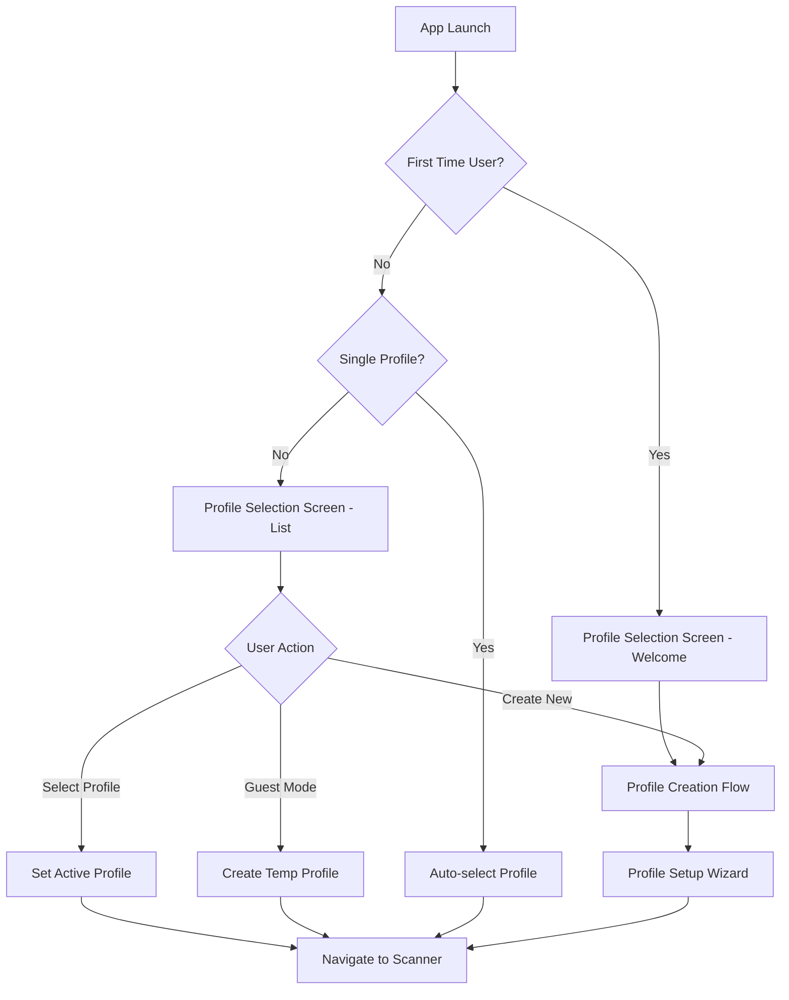
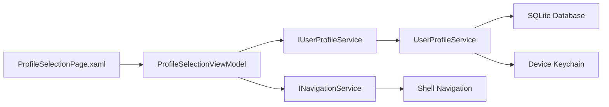

# Design Document

## Overview

The Profile Selection Screen serves as the entry point for the SMARTIES mobile application, providing users with a privacy-focused way to create, select, and manage multiple dietary profiles locally on their device. This design maintains the app's core principles of privacy-by-design, safety-first approach, and accessibility while providing an intuitive user experience for profile management.

The screen will be implemented using .NET MAUI with MVVM architecture, following the existing design system and patterns established in the application. All profile data will be stored locally using SQLite with device keychain encryption, ensuring complete privacy and offline functionality.

## Architecture

### High-Level Architecture



### MVVM Architecture Pattern



## Components and Interfaces

### Core Components

#### 1. ProfileSelectionPage (View)
- **Responsibility**: UI presentation and user interaction
- **Technology**: XAML with data binding
- **Key Features**: 
  - Responsive layout for different screen sizes
  - Accessibility support with semantic labels
  - Smooth animations and transitions
  - Touch-friendly interface elements

#### 2. ProfileSelectionViewModel (ViewModel)
- **Responsibility**: Business logic and data binding
- **Technology**: CommunityToolkit.Mvvm with ObservableObject
- **Key Properties**:
  - `ObservableCollection<ProfileDisplayItem> Profiles`
  - `bool IsFirstTimeUser`
  - `bool IsLoading`
  - `string WelcomeMessage`
  - `ProfileDisplayItem SelectedProfile`

#### 3. IUserProfileService (Service Interface)
- **Responsibility**: Profile management operations
- **Extended Methods**:
  - `Task<bool> IsFirstTimeUserAsync()`
  - `Task<UserProfile> CreateGuestProfileAsync()`
  - `Task<List<ProfileDisplayItem>> GetProfileDisplayItemsAsync()`
  - `Task<UserProfile> GetLastUsedProfileAsync()`

#### 4. ProfileDisplayItem (Model)
- **Responsibility**: UI-optimized profile representation
- **Properties**:
  - `int Id`
  - `string Name`
  - `string RestrictionSummary`
  - `string AvatarEmoji`
  - `bool IsLastUsed`
  - `DateTime LastUsedDate`
  - `int RestrictionCount`

### Service Extensions

#### Enhanced UserProfileService
```csharp
public class UserProfileService : IUserProfileService
{
    // Existing methods...
    
    public async Task<bool> IsFirstTimeUserAsync()
    {
        var profileCount = await _database.Table<UserProfile>().CountAsync();
        return profileCount == 0;
    }
    
    public async Task<UserProfile> CreateGuestProfileAsync()
    {
        return new UserProfile
        {
            Name = "Guest User",
            IsActive = true,
            IsTemporary = true, // New property
            Allergies = "[]",
            ReligiousRestrictions = "[]",
            MedicalRestrictions = "[]",
            LifestylePreferences = "[]"
        };
    }
    
    public async Task<List<ProfileDisplayItem>> GetProfileDisplayItemsAsync()
    {
        var profiles = await GetAllProfilesAsync();
        return profiles.Select(p => new ProfileDisplayItem
        {
            Id = p.Id,
            Name = p.Name,
            RestrictionSummary = GenerateRestrictionSummary(p),
            AvatarEmoji = GenerateAvatarEmoji(p),
            IsLastUsed = p.IsActive,
            LastUsedDate = p.UpdatedAt,
            RestrictionCount = CountRestrictions(p)
        }).ToList();
    }
}
```

## Data Models

### Extended UserProfile Model
```csharp
[Table("UserProfiles")]
public class UserProfile
{
    // Existing properties...
    
    [Ignore]
    public bool IsTemporary { get; set; } = false;
    
    public DateTime LastUsedAt { get; set; } = DateTime.UtcNow;
    
    public string AvatarEmoji { get; set; } = "👤";
    
    public int UsageCount { get; set; } = 0;
}
```

### ProfileDisplayItem Model
```csharp
public class ProfileDisplayItem
{
    public int Id { get; set; }
    public string Name { get; set; } = string.Empty;
    public string RestrictionSummary { get; set; } = string.Empty;
    public string AvatarEmoji { get; set; } = "👤";
    public bool IsLastUsed { get; set; }
    public DateTime LastUsedDate { get; set; }
    public int RestrictionCount { get; set; }
    public string FormattedLastUsed => FormatLastUsedDate();
    
    private string FormatLastUsedDate()
    {
        var timeSpan = DateTime.UtcNow - LastUsedDate;
        return timeSpan.TotalDays switch
        {
            < 1 => "Today",
            < 7 => $"{(int)timeSpan.TotalDays} days ago",
            < 30 => $"{(int)(timeSpan.TotalDays / 7)} weeks ago",
            _ => LastUsedDate.ToString("MMM dd")
        };
    }
}
```

## User Interface Design

### Screen States

#### 1. First Time User (Welcome State)
```xml
<StackLayout Spacing="30" Padding="40,60,40,40">
    <!-- SMARTIES Logo -->
    <Image Source="smarties_main_logo.png" 
           HeightRequest="120" 
           Aspect="AspectFit" />
    
    <!-- Welcome Message -->
    <StackLayout Spacing="15">
        <Label Text="Welcome to SMARTIES!" 
               Style="{StaticResource HeadlineLarge}"
               TextColor="{StaticResource Primary}"
               HorizontalOptions="Center" />
        <Label Text="Your personal dietary safety companion"
               Style="{StaticResource BodyMedium}"
               TextColor="{StaticResource OnSurface}"
               HorizontalOptions="Center" />
    </StackLayout>
    
    <!-- Privacy Notice -->
    <Border Style="{StaticResource InfoCard}">
        <StackLayout Spacing="10">
            <Label Text="🔒 Your Privacy Matters"
                   Style="{StaticResource BodyMediumBold}"
                   TextColor="{StaticResource Info}" />
            <Label Text="All your dietary information stays on your device. We never store or share your personal data."
                   Style="{StaticResource BodySmall}"
                   TextColor="{StaticResource OnSurface}" />
        </StackLayout>
    </Border>
    
    <!-- Action Buttons -->
    <StackLayout Spacing="15">
        <Button Text="Create My Profile"
                Style="{StaticResource PrimaryButton}"
                Command="{Binding CreateProfileCommand}" />
        <Button Text="Continue as Guest"
                Style="{StaticResource SecondaryButton}"
                Command="{Binding ContinueAsGuestCommand}" />
    </StackLayout>
</StackLayout>
```

#### 2. Profile Selection (List State)
```xml
<Grid RowDefinitions="Auto,*,Auto">
    <!-- Header -->
    <StackLayout Grid.Row="0" Spacing="15" Padding="20,40,20,20">
        <Label Text="Select Your Profile"
               Style="{StaticResource HeadlineMedium}"
               TextColor="{StaticResource OnSurface}" />
        <Label Text="Choose which dietary profile to use for scanning"
               Style="{StaticResource BodyMedium}"
               TextColor="{StaticResource OnSurfaceVariant}" />
    </StackLayout>
    
    <!-- Profile List -->
    <CollectionView Grid.Row="1" 
                    ItemsSource="{Binding Profiles}"
                    SelectionMode="Single"
                    SelectedItem="{Binding SelectedProfile}">
        <CollectionView.ItemTemplate>
            <DataTemplate x:DataType="models:ProfileDisplayItem">
                <Border Style="{StaticResource ProfileCard}"
                        Margin="20,5">
                    <Grid ColumnDefinitions="60,*,Auto" 
                          ColumnSpacing="15"
                          Padding="15">
                        <!-- Avatar -->
                        <Border Grid.Column="0"
                                Style="{StaticResource AvatarContainer}">
                            <Label Text="{Binding AvatarEmoji}"
                                   Style="{StaticResource AvatarEmoji}" />
                        </Border>
                        
                        <!-- Profile Info -->
                        <StackLayout Grid.Column="1" Spacing="5">
                            <Label Text="{Binding Name}"
                                   Style="{StaticResource BodyLargeBold}" />
                            <Label Text="{Binding RestrictionSummary}"
                                   Style="{StaticResource BodySmall}"
                                   TextColor="{StaticResource OnSurfaceVariant}" />
                            <Label Text="{Binding FormattedLastUsed}"
                                   Style="{StaticResource CaptionSmall}"
                                   TextColor="{StaticResource OnSurfaceVariant}"
                                   IsVisible="{Binding IsLastUsed}" />
                        </StackLayout>
                        
                        <!-- Selection Indicator -->
                        <Border Grid.Column="2"
                                Style="{StaticResource SelectionIndicator}"
                                IsVisible="{Binding IsLastUsed}">
                            <Label Text="✓"
                                   Style="{StaticResource SelectionCheck}" />
                        </Border>
                    </Grid>
                </Border>
            </DataTemplate>
        </CollectionView.ItemTemplate>
    </CollectionView>
    
    <!-- Bottom Actions -->
    <StackLayout Grid.Row="2" Spacing="10" Padding="20">
        <Button Text="+ Add New Profile"
                Style="{StaticResource SecondaryButton}"
                Command="{Binding AddNewProfileCommand}" />
        <Button Text="Continue as Guest"
                Style="{StaticResource TertiaryButton}"
                Command="{Binding ContinueAsGuestCommand}" />
    </StackLayout>
</Grid>
```

### Design System Integration

#### Color Scheme
- **Primary Actions**: `{StaticResource Primary}` (#28a745)
- **Secondary Actions**: `{StaticResource Secondary}` (#6c757d)
- **Safe Status**: `{StaticResource Success}` (#28a745)
- **Warning Status**: `{StaticResource Warning}` (#ffc107)
- **Danger Status**: `{StaticResource Danger}` (#dc3545)
- **Surface**: `{StaticResource Surface}` (#ffffff)
- **Background**: `{StaticResource Background}` (#ffffff)

#### Typography Styles
```xml
<Style x:Key="HeadlineLarge" TargetType="Label">
    <Setter Property="FontSize" Value="32" />
    <Setter Property="FontAttributes" Value="Bold" />
</Style>

<Style x:Key="HeadlineMedium" TargetType="Label">
    <Setter Property="FontSize" Value="24" />
    <Setter Property="FontAttributes" Value="Bold" />
</Style>

<Style x:Key="BodyLargeBold" TargetType="Label">
    <Setter Property="FontSize" Value="16" />
    <Setter Property="FontAttributes" Value="Bold" />
</Style>
```

#### Component Styles
```xml
<Style x:Key="ProfileCard" TargetType="Border">
    <Setter Property="BackgroundColor" Value="{StaticResource Surface}" />
    <Setter Property="Stroke" Value="{StaticResource Gray300}" />
    <Setter Property="StrokeThickness" Value="1" />
    <Setter Property="StrokeShape" Value="RoundRectangle 12" />
    <Setter Property="Shadow">
        <Shadow Brush="{StaticResource Gray400}" 
                Offset="0,2" 
                Radius="4" 
                Opacity="0.1" />
    </Setter>
</Style>

<Style x:Key="AvatarContainer" TargetType="Border">
    <Setter Property="BackgroundColor" Value="{StaticResource Gray100}" />
    <Setter Property="StrokeShape" Value="Ellipse" />
    <Setter Property="WidthRequest" Value="50" />
    <Setter Property="HeightRequest" Value="50" />
</Style>
```

## Error Handling

### Error Scenarios and Responses

#### 1. Database Connection Failure
```csharp
public async Task<List<ProfileDisplayItem>> GetProfileDisplayItemsAsync()
{
    try
    {
        var profiles = await GetAllProfilesAsync();
        return profiles.Select(MapToDisplayItem).ToList();
    }
    catch (SQLiteException ex)
    {
        _logger.LogError(ex, "Database error loading profiles");
        await ShowErrorDialog("Unable to load profiles. Please restart the app.");
        return new List<ProfileDisplayItem>();
    }
}
```

#### 2. Profile Creation Failure
```csharp
[RelayCommand]
private async Task CreateProfile()
{
    try
    {
        IsLoading = true;
        var newProfile = await _userProfileService.CreateProfileAsync(ProfileData);
        await NavigateToScanner();
    }
    catch (Exception ex)
    {
        _logger.LogError(ex, "Failed to create profile");
        await ShowErrorDialog("Failed to create profile. Please try again.");
    }
    finally
    {
        IsLoading = false;
    }
}
```

#### 3. Navigation Failure
```csharp
private async Task NavigateToScanner()
{
    try
    {
        await Shell.Current.GoToAsync("//Home");
    }
    catch (Exception ex)
    {
        _logger.LogError(ex, "Navigation failed");
        await ShowErrorDialog("Unable to continue. Please restart the app.");
    }
}
```

### Graceful Degradation
- **Offline Mode**: All functionality works without network connection
- **Low Memory**: Lazy loading of profile data and images
- **Slow Performance**: Loading indicators and progressive enhancement
- **Accessibility**: Fallback text for all visual elements

## Testing Strategy

### Unit Testing Focus Areas

#### 1. ViewModel Logic Testing
```csharp
[Test]
public async Task LoadProfiles_WhenFirstTimeUser_ShouldShowWelcomeState()
{
    // Arrange
    _mockUserProfileService.Setup(x => x.IsFirstTimeUserAsync())
        .ReturnsAsync(true);
    
    // Act
    await _viewModel.LoadProfilesAsync();
    
    // Assert
    Assert.IsTrue(_viewModel.IsFirstTimeUser);
    Assert.AreEqual("Welcome to SMARTIES!", _viewModel.WelcomeMessage);
}
```

#### 2. Service Integration Testing
```csharp
[Test]
public async Task CreateGuestProfile_ShouldCreateTemporaryProfile()
{
    // Arrange
    var service = new UserProfileService(_mockLogger.Object);
    
    // Act
    var guestProfile = await service.CreateGuestProfileAsync();
    
    // Assert
    Assert.AreEqual("Guest User", guestProfile.Name);
    Assert.IsTrue(guestProfile.IsTemporary);
    Assert.AreEqual("[]", guestProfile.Allergies);
}
```

### Integration Testing

#### 1. Navigation Flow Testing
```csharp
[Test]
public async Task ProfileSelection_ToScanner_ShouldNavigateCorrectly()
{
    // Arrange
    var profile = CreateTestProfile();
    
    // Act
    await _viewModel.SelectProfileCommand.ExecuteAsync(profile);
    
    // Assert
    _mockNavigationService.Verify(x => x.NavigateToAsync("//Home"), Times.Once);
}
```

#### 2. Database Persistence Testing
```csharp
[Test]
public async Task ProfileCreation_ShouldPersistToDatabase()
{
    // Arrange
    var newProfile = CreateTestProfile();
    
    // Act
    var createdProfile = await _userProfileService.CreateProfileAsync(newProfile);
    var retrievedProfile = await _userProfileService.GetActiveProfileAsync();
    
    // Assert
    Assert.AreEqual(createdProfile.Id, retrievedProfile.Id);
    Assert.AreEqual(newProfile.Name, retrievedProfile.Name);
}
```

### Accessibility Testing

#### 1. Screen Reader Compatibility
- All interactive elements have semantic labels
- Focus order follows logical reading sequence
- State changes are announced to screen readers

#### 2. High Contrast Support
- All text meets WCAG contrast requirements
- Visual indicators work in high contrast mode
- Color is not the only means of conveying information

#### 3. Dynamic Text Sizing
- Layout adapts to larger text sizes
- Touch targets remain accessible at all text sizes
- Content remains readable and functional

## Performance Considerations

### Optimization Strategies

#### 1. Lazy Loading
```csharp
public async Task LoadProfilesAsync()
{
    IsLoading = true;
    
    // Load basic profile info first
    var basicProfiles = await _userProfileService.GetBasicProfilesAsync();
    Profiles.Clear();
    foreach (var profile in basicProfiles)
    {
        Profiles.Add(profile);
    }
    
    // Load detailed info in background
    _ = Task.Run(async () => await LoadDetailedProfileInfoAsync());
    
    IsLoading = false;
}
```

#### 2. Memory Management
```csharp
public void OnDisappearing()
{
    // Clear large collections when not visible
    if (Profiles.Count > 10)
    {
        var activeProfiles = Profiles.Take(5).ToList();
        Profiles.Clear();
        foreach (var profile in activeProfiles)
        {
            Profiles.Add(profile);
        }
    }
}
```

#### 3. Database Optimization
```csharp
// Use indexed queries for better performance
[Indexed]
public bool IsActive { get; set; }

[Indexed]
public DateTime LastUsedAt { get; set; }
```

### Performance Targets
- **Screen Load Time**: < 500ms for profile list display
- **Profile Selection**: < 200ms to set active profile
- **Navigation**: < 300ms to reach scanner screen
- **Memory Usage**: < 50MB for profile management
- **Battery Impact**: Minimal - no background processing

## Security Implementation

### Data Protection
```csharp
public class SecureUserProfileService : IUserProfileService
{
    private readonly ISecureStorage _secureStorage;
    
    public async Task<UserProfile> CreateProfileAsync(UserProfile profile)
    {
        // Encrypt sensitive dietary information
        profile.Allergies = await EncryptDataAsync(profile.Allergies);
        profile.MedicalRestrictions = await EncryptDataAsync(profile.MedicalRestrictions);
        
        return await base.CreateProfileAsync(profile);
    }
    
    private async Task<string> EncryptDataAsync(string data)
    {
        // Use device keychain for encryption
        var key = await _secureStorage.GetAsync("profile_encryption_key");
        return CryptoHelper.Encrypt(data, key);
    }
}
```

### Privacy Compliance
- **Data Minimization**: Only collect necessary dietary information
- **Local Storage**: All data remains on device
- **Encryption**: Sensitive data encrypted with device keychain
- **No Tracking**: No analytics or user behavior tracking
- **Easy Deletion**: Complete profile removal on app uninstall

This design provides a comprehensive, privacy-focused profile selection experience that aligns with SMARTIES' core principles while delivering an intuitive and accessible user interface.