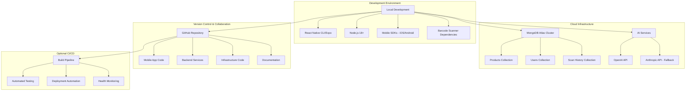
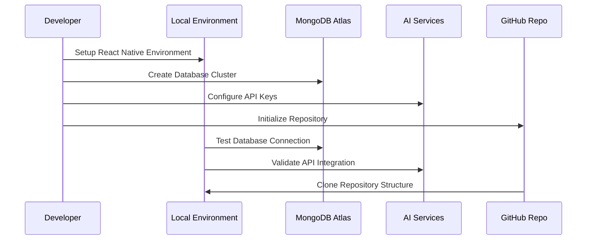

# Design Document

## Overview

The hackathon setup phase establishes the foundational infrastructure and development environment for the SMARTIES application. This design focuses on rapid deployment of cloud services, development tooling, and project structure to enable a productive 24-hour hackathon experience. The architecture prioritizes speed of setup over production-grade configuration, while maintaining security best practices and scalability considerations for future development.

## Architecture

### High-Level Architecture



### Component Interactions



## Components and Interfaces

### MongoDB Atlas Database

**Purpose**: Centralized cloud database for storing product data, user profiles, and scan results

**Configuration**:
- **Cluster Type**: Free tier (M0) for hackathon development
- **Region**: Closest to development team location
- **Collections**:
  - `products`: Product information from Open Food Facts API
  - `users`: User dietary profiles and preferences
  - `scan_history`: Individual scan results and timestamps
- **Network Access**: Configured for development IP ranges
- **Authentication**: Database user with read/write permissions

**Design Rationale**: MongoDB Atlas provides instant cloud database deployment with built-in security, scaling capabilities, and easy integration with React Native applications. The free tier is sufficient for hackathon development while providing a clear upgrade path.

### React Native Development Environment

**Purpose**: Cross-platform mobile development setup supporting both iOS and Android

**Components**:
- **React Native CLI or Expo CLI**: Framework for mobile app development
- **Node.js 18+**: Runtime environment and package management
- **Mobile SDKs**: 
  - iOS: Xcode and iOS Simulator
  - Android: Android Studio and Android SDK
- **Barcode Scanner**: expo-barcode-scanner for UPC code reading
- **Development Tools**: Metro bundler, debugging tools, device testing

**Design Rationale**: React Native enables rapid cross-platform development with a single codebase. Expo provides additional tooling and services that accelerate development, while maintaining the option to eject for native functionality if needed.

### AI Services Integration

**Purpose**: Provide intelligent dietary analysis and product recommendations

**Primary Service**: OpenAI API
- **Model**: GPT-4 for complex dietary analysis
- **Use Cases**: Ingredient analysis, allergen detection, dietary compliance checking
- **Rate Limits**: Configured for hackathon usage patterns
- **Security**: API keys stored in environment variables

**Fallback Service**: Anthropic API (Claude)
- **Purpose**: Backup AI service if OpenAI experiences issues
- **Configuration**: Similar setup to OpenAI with separate API keys

**Design Rationale**: Dual AI service setup ensures reliability during the hackathon. OpenAI provides excellent performance for dietary analysis, while Anthropic serves as a robust fallback option.

### GitHub Repository Structure

**Purpose**: Version control, collaboration, and project organization

**Repository Structure**:
```
smarties/
├── README.md                    # Setup instructions and project overview
├── .gitignore                   # React Native and Node.js exclusions
├── package.json                 # Dependencies and scripts
├── src/                         # Application source code
│   ├── components/              # Reusable UI components
│   ├── screens/                 # Main application screens
│   ├── services/                # Business logic and API calls
│   └── utils/                   # Helper functions
├── docs/                        # Documentation and guides
├── tests/                       # Test files and configurations
└── infrastructure/              # Deployment and configuration files
```

**Collaboration Features**:
- Branch protection rules for main branch
- Pull request templates for code review
- Issue templates for bug reports and feature requests
- Basic CI/CD workflow files (if time permits)

**Design Rationale**: Clear project structure enables efficient team collaboration during the hackathon. Separation of concerns between mobile app, documentation, and infrastructure code provides organization and maintainability.

### Optional CI/CD Infrastructure

**Purpose**: Automated build, test, and deployment pipeline (time permitting)

**Components**:
- **Build Pipeline**: Automated compilation and packaging
- **Testing**: Basic unit tests and integration tests
- **Deployment**: Automated deployment to test environments
- **Monitoring**: Basic health checks and error reporting

**Design Rationale**: CI/CD setup is marked as optional to prioritize core functionality during the hackathon. If time allows, basic automation can improve development velocity and code quality.

## Data Models

### Database Schema Design

**Products Collection**:
```javascript
{
  _id: ObjectId,
  upc: String,                    // Barcode identifier
  name: String,                   // Product name
  brand: String,                  // Manufacturer
  ingredients: [String],          // List of ingredients
  allergens: [String],           // Known allergens
  nutritional_info: {
    calories: Number,
    sodium: Number,
    sugar: Number,
    // ... other nutritional data
  },
  dietary_flags: {
    vegan: Boolean,
    kosher: Boolean,
    halal: Boolean,
    gluten_free: Boolean
  },
  source: String,                // Data source (Open Food Facts, manual, etc.)
  last_updated: Date,
  confidence_score: Number       // Data quality indicator
}
```

**Users Collection**:
```javascript
{
  _id: ObjectId,
  user_id: String,               // Unique user identifier
  dietary_restrictions: {
    allergies: [String],         // Food allergies
    medical: [String],           // Medical dietary needs
    religious: [String],         // Religious restrictions
    lifestyle: [String]          // Lifestyle choices (vegan, etc.)
  },
  preferences: {
    strict_mode: Boolean,        // Strict vs. flexible compliance
    notification_level: String,  // Alert preferences
    language: String             // UI language preference
  },
  created_at: Date,
  last_active: Date
}
```

**Scan History Collection**:
```javascript
{
  _id: ObjectId,
  user_id: String,
  product_upc: String,
  scan_timestamp: Date,
  compliance_result: {
    safe: Boolean,
    violations: [String],
    warnings: [String],
    confidence: Number
  },
  location: {                    // Optional geolocation
    latitude: Number,
    longitude: Number
  }
}
```

## Error Handling

### Database Connection Failures

**Scenario**: MongoDB Atlas connection issues
**Handling Strategy**:
- Implement connection retry logic with exponential backoff
- Cache recent scan results locally for offline access
- Display user-friendly error messages with suggested actions
- Log detailed error information for debugging

### AI Service Failures

**Scenario**: OpenAI or Anthropic API unavailable
**Handling Strategy**:
- Automatic failover to backup AI service
- Basic rule-based allergen detection as final fallback
- Queue requests for retry when service recovers
- Inform users of reduced functionality during outages

### Barcode Recognition Failures

**Scenario**: Unable to read barcode or product not found
**Handling Strategy**:
- Provide manual UPC entry option
- Allow users to photograph product label for manual processing
- Enable user-contributed product information
- Suggest alternative products when available

### Network Connectivity Issues

**Scenario**: Poor or no internet connection
**Handling Strategy**:
- Offline-first architecture with local data caching
- Sync data when connection is restored
- Core safety features work without internet
- Clear indicators of offline vs. online status

## Testing Strategy

### Development Environment Testing

**Unit Tests**:
- Database connection and query functions
- AI service integration and response parsing
- Barcode scanning and product lookup logic
- User profile management and dietary analysis

**Integration Tests**:
- End-to-end product scanning workflow
- Database read/write operations
- AI service API calls and error handling
- Cross-platform mobile app functionality

**Manual Testing**:
- Physical device testing on iOS and Android
- Barcode scanning with real products
- Network connectivity scenarios (online/offline)
- User interface and accessibility testing

### Infrastructure Testing

**Connection Tests**:
- MongoDB Atlas cluster connectivity
- AI service API authentication and rate limits
- GitHub repository access and collaboration features
- Mobile development environment setup verification

**Performance Tests**:
- Database query response times
- AI service response latency
- Mobile app startup and scanning speed
- Memory usage and battery impact

### Security Testing

**Authentication Tests**:
- Database user permissions and access control
- AI service API key security and rotation
- User data encryption and privacy protection
- Network communication security (HTTPS/TLS)

**Data Protection Tests**:
- Personal information handling and storage
- Secure transmission of sensitive data
- Compliance with privacy regulations
- User consent and data deletion capabilities

## Design Decisions and Rationales

### Technology Stack Choices

**React Native over Native Development**:
- **Rationale**: Enables single codebase for iOS and Android, reducing development time during 24-hour hackathon
- **Trade-off**: Slightly reduced performance compared to native apps, but acceptable for MVP

**MongoDB Atlas over Self-Hosted Database**:
- **Rationale**: Instant deployment, built-in security, automatic scaling, and managed backups
- **Trade-off**: Vendor lock-in and potential costs, but free tier sufficient for hackathon

**Dual AI Service Setup**:
- **Rationale**: Ensures reliability during hackathon when service availability is critical
- **Trade-off**: Additional complexity in API management, but provides essential redundancy

**Expo vs. React Native CLI**:
- **Rationale**: Expo provides faster setup and additional services, while CLI offers more flexibility
- **Decision**: Start with Expo for speed, with option to eject if native functionality needed

### Architecture Patterns

**Offline-First Design**:
- **Rationale**: Core safety features must work without internet connection for user safety
- **Implementation**: Local caching of user profiles and recent scan results

**Microservices vs. Monolithic Backend**:
- **Decision**: Simplified monolithic approach for hackathon speed
- **Rationale**: Reduces complexity and deployment overhead during rapid development

**Security-First Configuration**:
- **Rationale**: Even in hackathon environment, user data protection is paramount
- **Implementation**: Environment variables for secrets, encrypted data transmission, secure database access