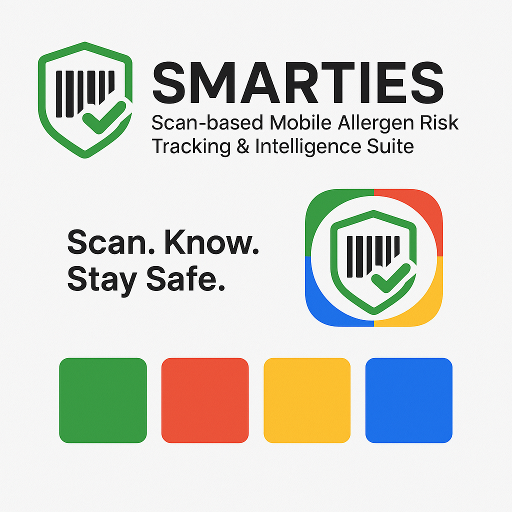
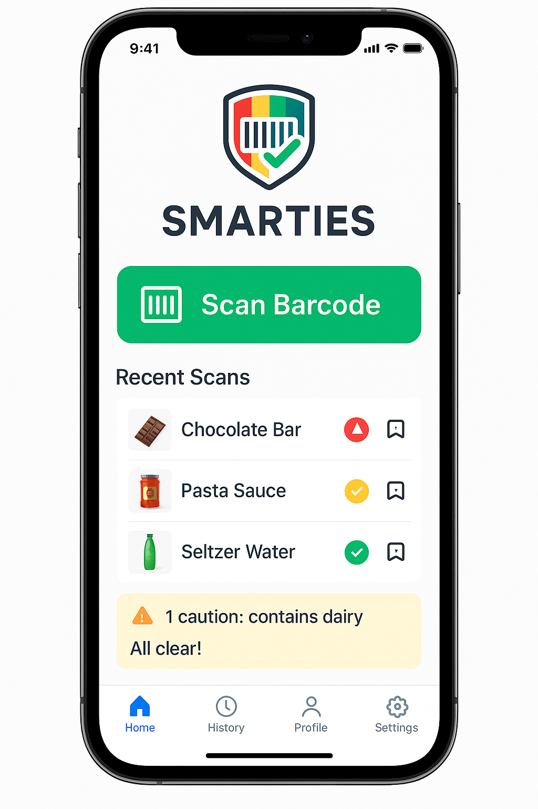
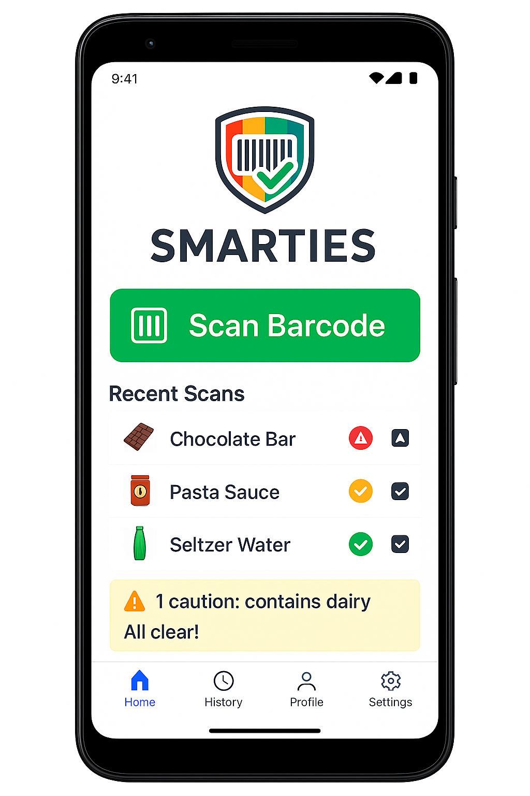

# SMARTIES 🛡️📱

**S**can‑based **M**obile **A**llergen **R**isk **T**racking & **I**ntelligenc**E** **S**uite

A React Native mobile application that provides instant dietary compliance checking through UPC barcode scanning, powered by MongoDB Atlas and AI.



## 🎯 Mission

Empower users to make safe dietary choices instantly by scanning product barcodes and receiving real-time compliance alerts for allergies, religious restrictions, medical conditions, and lifestyle preferences.

## ✨ Key Features

### 🔍 **Instant Barcode Scanning**
- Sub-3-second scan-to-result response time
- UPC barcode recognition with image OCR fallback
- Offline-first architecture for core safety features

### 🛡️ **Comprehensive Dietary Analysis**
- **Allergies**: FDA Top 9 + additional allergens
- **Religious**: Halal, Kosher, Hindu vegetarian, Jain, Buddhist
- **Medical**: Diabetes, hypertension, celiac, kidney disease
- **Lifestyle**: Vegan, vegetarian, keto, paleo, organic-only, non-GMO

### 🚨 **Safety-First Alerts**
- 🔴 **Red**: Violation/Danger - Never miss critical restrictions
- 🟡 **Yellow**: Caution - Possible risk or uncertainty
- 🟢 **Green**: Safe - Compliant with all restrictions

### 🤖 **AI-Powered Intelligence**
- Vector similarity search with MongoDB Atlas
- RAG (Retrieval-Augmented Generation) pipeline
- OpenAI/Anthropic integration for complex analysis
- Confidence scoring for product data quality

## 📱 User Interface

### Mobile App Mockups

| iOS Home Screen | Android Home Screen |
|-----------------|---------------------|
|  |  |

### Design Principles
- **Scan-First Interface**: Large, accessible barcode scanner as primary entry point
- **Color-Coded Safety**: Immediate visual feedback with universal color system
- **One-Tap Actions**: Save products, mark favorites, report issues
- **Accessibility**: Full VoiceOver/TalkBack support for visually impaired users

## 🏗️ Technical Architecture

### Technology Stack

| Component | Technology | Purpose |
|-----------|------------|---------|
| **Mobile Framework** | React Native + TypeScript | Cross-platform native performance |
| **Database** | MongoDB Atlas + Realm SDK | Offline sync and vector search |
| **AI/ML** | OpenAI/Anthropic APIs | Dietary analysis and recommendations |
| **Barcode Scanning** | expo-barcode-scanner | UPC recognition |
| **Data Sources** | Open Food Facts API, USDA Food Data Central | Product and nutritional data |

### Project Structure

```
smarties/
├── src/
│   ├── components/          # Reusable UI components
│   │   ├── scanner/         # Barcode scanning components
│   │   ├── profile/         # User profile management
│   │   ├── alerts/          # Alert and warning components
│   │   └── common/          # Shared UI components
│   ├── screens/             # Main application screens
│   │   ├── ScanScreen.tsx   # Primary scanning interface
│   │   ├── ProfileScreen.tsx # Dietary profile management
│   │   ├── HistoryScreen.tsx # Scan history and analytics
│   │   └── SettingsScreen.tsx # App configuration
│   ├── services/            # Business logic and API integrations
│   │   ├── atlas/           # MongoDB Atlas integration
│   │   ├── ai/              # GenAI and RAG pipeline
│   │   ├── barcode/         # Barcode scanning logic
│   │   └── dietary/         # Dietary compliance checking
│   ├── models/              # Data models and schemas
│   └── utils/               # Helper functions
├── tests/                   # Comprehensive test suite
├── docs/                    # Documentation
└── design/                  # UI/UX assets and mockups
```

### Data Flow Architecture

```
Scan → Lookup → Analyze → Alert → Store
  ↓       ↓        ↓       ↓      ↓
Camera → API → AI/RAG → UI → Cache
```

## 🚀 Performance Requirements

| Metric | Target | Critical Threshold |
|--------|--------|--------------------|
| **Barcode Recognition** | <1 second | <2 seconds |
| **Product Lookup** | <2 seconds (cached) | <5 seconds (API) |
| **AI Analysis** | <3 seconds | <5 seconds |
| **App Launch** | <2 seconds to scanner ready | <3 seconds |
| **Battery Impact** | <5% drain per hour | <10% drain per hour |

## 🔒 Security & Privacy

- **Local Encryption**: User profiles encrypted with device keychain
- **Data Minimization**: Only store necessary dietary restrictions
- **Anonymized Analytics**: Track usage patterns without PII
- **GDPR Compliance**: Right to deletion and data portability
- **Secure APIs**: HTTPS for all communications, no API keys in code

## 🧪 Development & Testing

### Setup Commands
```bash
# Install dependencies
npm install

# Start development server
npx react-native start

# Run on iOS
npx react-native run-ios

# Run on Android
npx react-native run-android

# Run tests
npm test                    # Unit tests
npm run test:integration   # Integration tests
npm run test:e2e          # End-to-end tests
```

### Testing Strategy
- **Critical Path Testing**: Barcode scanning → product lookup → dietary analysis → warning display
- **Edge Case Coverage**: Unknown products, network failures, corrupted barcodes
- **Performance Testing**: Scan speed, memory usage, battery impact
- **Accessibility Testing**: Screen reader compatibility, high contrast mode

### Code Quality Standards
- TypeScript strict mode with null checks
- ESLint and Prettier for consistent formatting
- >80% test coverage for critical paths
- Conventional commit messages
- Accessibility compliance (WCAG 2.1 AA)

## 📊 Success Metrics

### User Safety (Primary)
- **Zero Critical Misses**: No false negatives for severe allergies
- **Accuracy Rate**: >99% for allergen detection, >95% for lifestyle preferences
- **Response Time**: <3 seconds average scan-to-result

### User Engagement (Secondary)
- **Daily Active Users**: Target 70% retention after 30 days
- **Scans per Session**: Average 3-5 products per app open
- **Profile Completion**: 90% of users complete dietary restriction setup

## 🗺️ Roadmap

### Phase 1: MVP - UPC Scanning ✅
- Barcode scanning and basic allergen detection
- User profile setup and offline core functionality
- Product favorites and scan history

### Phase 2: Enhanced Recognition 🚧
- Package image recognition when barcodes fail
- Improved AI accuracy and family profiles
- Advanced analytics and recommendations

### Phase 3: Prepared Foods 📋
- Plate/meal image recognition
- Restaurant menu integration
- Recipe analysis and meal planning

## 🤝 Contributing

We welcome contributions! Please see our [Contributing Guidelines](CONTRIBUTING.md) for details on:
- Code style and conventions
- Testing requirements
- Pull request process
- Issue reporting

### Development Guidelines
- Follow TypeScript strict mode
- Use functional components with hooks
- Implement proper error handling
- Write comprehensive tests
- Ensure accessibility compliance

## 📄 License

This project is licensed under the MIT License - see the [LICENSE](LICENSE) file for details.

## 🆘 Support & Documentation

### 📚 Complete Documentation Suite
- **[Development Setup Guide](DEVELOPMENT_SETUP.md)** - Complete environment setup instructions
- **[Troubleshooting Guide](TROUBLESHOOTING.md)** - Common issues and solutions
- **[Team Onboarding Guide](TEAM_ONBOARDING.md)** - New team member guide
- **[Project Documentation](/docs)** - Additional technical documentation

### 🔧 Quick Setup
```bash
# 1. Install dependencies
npm install && cd smarties && npm install

# 2. Configure environment
cp .env.example .env
# Edit .env with your credentials

# 3. Start development
npm start
```

### 🆘 Getting Help
- **Setup Issues**: Check [DEVELOPMENT_SETUP.md](DEVELOPMENT_SETUP.md)
- **Runtime Problems**: Check [TROUBLESHOOTING.md](TROUBLESHOOTING.md)
- **New Team Members**: Start with [TEAM_ONBOARDING.md](TEAM_ONBOARDING.md)
- **Bug Reports**: Create GitHub Issues
- **Questions**: Use GitHub Discussions

## 🙏 Acknowledgments

- **Open Food Facts**: Primary product database (2M+ products)
- **USDA Food Data Central**: Nutritional information
- **MongoDB Atlas**: Database and vector search capabilities
- **OpenAI/Anthropic**: AI-powered dietary analysis
- **React Native Community**: Cross-platform mobile framework

---

**Built with ❤️ for dietary safety and accessibility**

*SMARTIES - Making food choices safer, one scan at a time.*